# Enterprise SCM / ERP Platform — Architecture & Database Design

**Version:** 2.0
**Prepared for:** Aivora — Next-Generation AI-Enabled Supply Chain Management Platform
**Status:** Draft for internal review

---

## Table of Contents

1. [Executive Summary](#1-executive-summary)
2. [Business Requirements](#2-business-requirements)
3. [Functional Architecture](#3-functional-architecture)
4. [Detailed ER Diagram (100+ Tables)](#4-detailed-er-diagram-100-tables)
5. [Table-by-Table Schema Definitions](#5-table-by-table-schema-definitions)
6. [Primary Keys / Foreign Keys — Conventions & Reference Map](#6-primary-keys--foreign-keys--conventions--reference-map)
7. [Inventory Ledger Design](#7-inventory-ledger-design)
8. [Double-Entry Accounting & GL Posting Flows](#8-double-entry-accounting--gl-posting-flows)
9. [Warehouse & Barcode Architecture](#9-warehouse--barcode-architecture)
10. [Batch / Serial Number Traceability](#10-batch--serial-number-traceability)
11. [GST / Tax Architecture](#11-gst--tax-architecture)
12. [RBAC Security Model](#12-rbac-security-model)
13. [Multi-Tenant SaaS Design](#13-multi-tenant-saas-design)
14. [API Architecture](#14-api-architecture)
15. [AI/ML Roadmap](#15-aiml-roadmap)
16. [Technology Stack Recommendations](#16-technology-stack-recommendations)
17. [Deployment Architecture (AWS / Azure / GCP)](#17-deployment-architecture-aws--azure--gcp)
18. [UML & Data Flow Diagrams](#18-uml--data-flow-diagrams)

---

## 1. Executive Summary

Aivora is a next-generation, AI-enabled Supply Chain Management (SCM) / ERP platform
designed to unify procurement, inventory, warehouse operations, sales & distribution,
finance, taxation, and analytics into a single, modular, multi-tenant system of record.

Unlike legacy ERPs that mutate balances in place, Aivora is **ledger-driven**: every
inventory movement and every financial event is captured as an **immutable transaction**
in an Inventory Ledger or General Ledger. Current-state balances (stock on hand, account
balances, customer/supplier dues) are *derived* by aggregating ledger entries, not stored
and mutated directly. This produces a fully auditable, replayable system of record that is
naturally suited to AI/ML consumption — every state change is an explainable, timestamped
event.

The platform is built as a **modular monolith with service-oriented boundaries**, deployed
as independently scalable workspaces (API, Web, AI services, background workers), backed
by a relational database (PostgreSQL) with an event/streaming layer for AI pipelines and
integrations.

Key outcomes this architecture is designed to deliver:

- **Single source of truth** for inventory and financial position, derived from immutable,
  append-only ledgers.
- **End-to-end traceability** — from supplier lot, to warehouse bin, to batch/serial, to
  customer shipment, to GL posting — supporting recalls, audits, and compliance (including
  GST/e-invoicing in India and analogous VAT/sales-tax regimes elsewhere).
- **Multi-tenant SaaS delivery** with strict data isolation, configurable per-tenant
  chart of accounts, tax codes, numbering sequences, and workflows.
- **AI-native data model** — clean, well-typed, event-sourced data that can directly feed
  demand forecasting, anomaly detection, procurement recommendations, and autonomous
  replenishment without a separate data-warehouse remodeling exercise.
- **Composable APIs** that allow the web app, mobile/warehouse scanners, partner EDI
  integrations, and AI agents to operate against the same governed data layer.

This document expands the v1.0 architecture summary into a full design specification:
business requirements, a 100+ table entity model grouped by domain, schema-level detail
for the backbone tables (with primary/foreign key conventions), the ledger and GL posting
flows, warehouse/barcode and batch/serial traceability designs, the GST/tax architecture,
the RBAC and multi-tenancy models, the API and deployment architectures, and a phased
AI/ML roadmap.

---

## 2. Business Requirements

### 2.1 Stakeholders & Personas

| Persona | Primary Needs |
|---|---|
| Warehouse Operator | Fast barcode/RFID scanning for putaway, picking, packing, cycle counts; mobile-first UI |
| Procurement Manager | Supplier comparison, PO creation/approval, AI-driven reorder suggestions |
| Sales / Order Desk | Order entry, available-to-promise checks, pricing, dispatch tracking |
| Inventory Controller | Real-time stock visibility, batch/serial traceability, ledger reconciliation |
| Accountant / Controller | AP/AR processing, GL close, tax filing, financial reporting |
| Compliance Officer | GST/e-invoice compliance, audit trails, document retention |
| Tenant Admin | User/role management, configuration of company, tax codes, numbering, workflows |
| Platform Admin (Aivora) | Tenant provisioning, billing, platform health, security monitoring |
| Data Scientist / AI Engineer | Clean event-level data access for forecasting and ML model training |
| Executive / Finance Leadership | Dashboards: working capital, inventory turns, margin, cash flow |

### 2.2 Functional Requirements (by Module)

**Security & RBAC**
- FR-1: System shall support role-based access control with hierarchical roles and
  fine-grained permissions at the module/action/field level.
- FR-2: System shall support row-level security scoped by tenant, warehouse, and
  organizational unit.
- FR-3: System shall log all authentication events and privileged actions to an
  immutable audit trail.

**Master Data**
- FR-4: System shall maintain a single, de-duplicated master for items, suppliers,
  customers, warehouses, locations, units of measure, price lists, and tax codes.
- FR-5: Items shall support hierarchical categorization, multiple UOMs with conversion
  factors, and configurable attributes (dimensions, weight, HSN/SAC codes, shelf life).

**Supplier & Customer Management**
- FR-6: System shall maintain supplier/customer profiles including contacts, addresses,
  bank details, tax registrations (GSTIN/VAT ID), credit terms, and performance ratings.
- FR-7: System shall support supplier onboarding and approval workflows.

**Procurement**
- FR-8: System shall support purchase requisitions, RFQs, purchase orders, goods
  receipts, and three-way matching (PO ↔ GRN ↔ Invoice).
- FR-9: System shall support partial receipts, over/under-delivery tolerances, and
  PO amendments with full version history.
- FR-10: System shall provide AI-generated reorder recommendations based on
  consumption history, lead time, and forecasted demand.

**Warehouse Management**
- FR-11: System shall support multiple warehouses, zones, aisles, racks, bins, and
  license-plate (container) based movements.
- FR-12: System shall support barcode/QR/RFID scanning for receiving, putaway, picking,
  packing, shipping, and cycle counting, with offline-capable mobile workflows.
- FR-13: System shall support wave/batch picking, pick-path optimization, and
  task assignment.

**Inventory Management**
- FR-14: All inventory changes shall be recorded as immutable Inventory Ledger entries;
  on-hand, allocated, and available quantities shall be derived, never directly mutated.
- FR-15: System shall support batch/lot tracking, serial number tracking, expiry-date
  management, and FEFO/FIFO/LIFO valuation strategies per item.
- FR-16: System shall support stock transfers, adjustments, reservations, and
  cycle-count reconciliation, each generating ledger entries with full reason coding.

**Sales & Distribution**
- FR-17: System shall support quotations, sales orders, allocation/ATP checks, pick-pack-
  ship workflows, and delivery/shipment tracking.
- FR-18: System shall support flexible pricing (price lists, customer-specific pricing,
  promotions, volume discounts) and credit-limit checks at order entry.

**GST & Taxation**
- FR-19: System shall calculate taxes (e.g., CGST/SGST/IGST/cess for India GST, or
  VAT/sales tax for other regimes) based on configurable tax codes, place-of-supply
  rules, and HSN/SAC mappings.
- FR-20: System shall generate e-invoices/e-way bills (where applicable) and statutory
  tax reports (e.g., GSTR-1/GSTR-3B equivalents).

**Accounts Payable / Receivable / General Ledger**
- FR-21: System shall generate AP invoices from GRNs/PO matching and AR invoices from
  shipments, post them to the GL as balanced double-entry journals, and track
  payments/receipts against open items.
- FR-22: System shall maintain a configurable Chart of Accounts and post all
  sub-ledger activity (procurement, sales, inventory adjustments, tax, payments) to the
  General Ledger as immutable journal entries that always balance (debits = credits).
- FR-23: System shall support period close, trial balance, and standard financial
  statements (P&L, Balance Sheet, Cash Flow).

**Reporting & Analytics / AI**
- FR-24: System shall provide role-based dashboards and scheduled/ad-hoc reports across
  all modules.
- FR-25: System shall expose a governed data layer (views/event streams) for AI/ML
  consumption: demand forecasting, procurement recommendations, anomaly detection, and
  autonomous replenishment.

### 2.3 Non-Functional Requirements

| Category | Requirement |
|---|---|
| Scalability | Support 1,000+ tenants, 10M+ ledger rows per tenant per year, horizontal scale-out of API and worker tiers |
| Availability | ≥ 99.9% uptime for core transactional services; multi-AZ deployment |
| Performance | P95 API latency < 300ms for transactional endpoints; sub-second barcode scan acknowledgement |
| Auditability | Every create/update/delete on financial and inventory data is attributable, timestamped, and immutable |
| Data Isolation | Strict tenant isolation (logical or physical) with no cross-tenant data leakage |
| Compliance | GST/e-invoicing (India), SOC 2-aligned controls, configurable data-retention policies |
| Extensibility | New modules/fields/workflows addable via configuration, not schema rewrites, where possible |
| Internationalization | Multi-currency, multi-language, multi-tax-regime support |
| Offline Support | Warehouse mobile apps must queue scans offline and sync when connectivity returns |

---

## 3. Functional Architecture

### 3.1 Layered View

```
┌──────────────────────────────────────────────────────────────────────┐
│  Channels                                                             │
│  Web App (Next.js)  │  Mobile/Scanner (RN/PWA)  │  Partner EDI/API   │
└───────────────┬─────────────────────┬──────────────────┬─────────────┘
                │                      │                  │
┌───────────────▼──────────────────────▼──────────────────▼─────────────┐
│  API Gateway / BFF Layer                                              │
│  AuthN (OIDC/JWT) · AuthZ (RBAC/ABAC) · Rate limiting · Tenant resolve │
└───────────────┬───────────────────────────────────────────────────────┘
                │
┌───────────────▼───────────────────────────────────────────────────────┐
│  Domain Services (modular monolith / service-oriented modules)        │
│                                                                        │
│  ┌────────────┐ ┌────────────┐ ┌────────────┐ ┌────────────┐         │
│  │ Master Data│ │ Procurement│ │ Warehouse  │ │ Inventory  │         │
│  │ & Parties  │ │            │ │ Mgmt (WMS) │ │ Ledger     │         │
│  └────────────┘ └────────────┘ └────────────┘ └────────────┘         │
│  ┌────────────┐ ┌────────────┐ ┌────────────┐ ┌────────────┐         │
│  │ Sales &    │ │ Tax / GST  │ │ AP / AR    │ │ General    │         │
│  │ Distribution│ │            │ │            │ │ Ledger     │         │
│  └────────────┘ └────────────┘ └────────────┘ └────────────┘         │
│  ┌────────────┐ ┌────────────┐ ┌────────────┐ ┌────────────┐         │
│  │ Security & │ │ Reporting &│ │ AI / ML    │ │ Notification│        │
│  │ RBAC       │ │ Analytics  │ │ Services   │ │ & Workflow  │        │
│  └────────────┘ └────────────┘ └────────────┘ └────────────┘         │
└───────────────┬───────────────────────────────────────┬───────────────┘
                │                                        │
┌───────────────▼─────────────────┐    ┌─────────────────▼───────────────┐
│  Transactional Data Layer        │    │  Event / Streaming Layer        │
│  PostgreSQL (multi-schema,       │    │  Kafka/Kinesis/PubSub:          │
│  row-level security)             │    │  ledger.*, gl.*, order.* topics │
│  - OLTP tables (this document)   │    │  → AI feature store, warehouse  │
│  - Read replicas for reporting   │    │  → search index, audit log      │
└──────────────────────────────────┘    └─────────────────────────────────┘
```

### 3.2 Architectural Style

- **Modular monolith with bounded contexts.** Each functional module (Procurement,
  Inventory, Sales, Finance, etc.) is a separate codebase module with its own
  service/repository layer and an explicit public interface. This allows the platform to
  start as a single deployable (faster delivery, simpler transactions/joins across
  modules) while preserving clean seams for extraction into independent services as scale
  demands (e.g., Inventory Ledger and AI services are the most likely first candidates for
  extraction).
- **Ledger-first / event-sourced sub-domains.** Inventory and Finance are modeled as
  append-only ledgers. Mutating "current state" tables directly is disallowed in these
  domains; all state changes flow through ledger-entry creation, and balances are
  materialized via aggregation (live queries for low volume, materialized views /
  rollup tables for high volume).
- **CQRS-leaning for reporting.** Transactional writes go through the domain services;
  reporting and analytics read from replicas/materialized views/rollup tables to avoid
  contention with OLTP workloads.
- **Event-driven integration.** Domain events (e.g., `GRNPosted`, `InvoiceIssued`,
  `StockAdjusted`, `JournalPosted`) are published to a streaming layer, consumed by AI
  pipelines, search indexing, notifications, and external integrations (EDI, e-invoicing).

### 3.3 Module Responsibilities (Summary)

| Module | Responsibility | Key Outputs |
|---|---|---|
| Security & RBAC | AuthN/AuthZ, roles, permissions, audit log | Session tokens, audit events |
| Master Data | Items, UOM, price lists, tax codes, locations | Canonical reference data |
| Supplier / Customer Mgmt | Party master, contacts, credit, ratings | Supplier/customer records |
| Procurement | Requisition → RFQ → PO → GRN → Invoice match | POs, GRNs, AP source docs |
| Warehouse Mgmt | Bin/zone topology, tasks, scanning, cycle count | Movement instructions, scan events |
| Inventory Ledger | Immutable stock movement records, balance derivation | Ledger entries, stock snapshots |
| Sales & Distribution | Quote → Order → Allocation → Pick/Pack/Ship | Sales orders, shipments, AR source docs |
| GST & Taxation | Tax computation, e-invoicing, statutory reports | Tax lines, e-invoice payloads, returns |
| Accounts Payable | Vendor invoice processing, payments | AP invoices, payment vouchers |
| Accounts Receivable | Customer invoicing, collections | AR invoices, receipts |
| General Ledger | Double-entry posting, period close, statements | GL journals, trial balance, financials |
| Reporting & Analytics | Dashboards, scheduled reports, data exports | Reports, exports, BI feeds |
| AI / ML Services | Forecasting, recommendations, anomaly detection | Predictions, suggested actions |

---

## 4. Detailed ER Diagram (100+ Tables)

The data model is organized into 16 domains comprising **~127 tables**. Each domain is
listed below with its tables and a one-line purpose. Section 5 then provides full
column-level schema for the ~50 "backbone" tables (marked **★**) that carry the core
transactional and relational weight of the system; the remaining tables follow the same
naming, key, and audit-column conventions described in Section 6.

### 4.1 Domain → Table Inventory

**A. Platform & Multi-Tenancy (8)**
| Table | Purpose |
|---|---|
| `tenants` ★ | Top-level SaaS tenant record |
| `tenant_subscriptions` | Plan, billing cycle, entitlements per tenant |
| `tenant_settings` | Key/value configuration per tenant |
| `companies` ★ | Legal entity (books of account) within a tenant |
| `branches` | Business units / branches under a company |
| `fiscal_years` | Accounting year definitions per company |
| `fiscal_periods` ★ | Open/closed accounting periods (months/quarters) |
| `number_sequences` | Configurable document numbering (PO-2026-00001, etc.) |

**B. Security & RBAC (13)**
| Table | Purpose |
|---|---|
| `users` ★ | Platform user accounts |
| `roles` ★ | Named roles (e.g., Warehouse Operator, Controller) |
| `permissions` ★ | Atomic permission grants (module.action.scope) |
| `role_permissions` ★ | Role ↔ permission assignment, with optional ABAC `condition_expr` (§12.5) |
| `user_roles` ★ | User ↔ role assignment (scoped by company/branch) |
| `user_sessions` | Active session/JWT refresh-token tracking |
| `password_reset_tokens` | One-time tokens for credential recovery |
| `audit_logs` ★ | Immutable record of privileged actions and data changes |
| `login_history` | Authentication attempt history (success/failure, IP, device) |
| `api_keys` | Machine-to-machine credentials for integrations |
| `sod_conflict_rules` ★ | Defines forbidden permission/role combinations — the Segregation-of-Duties matrix (§12.6) |
| `sod_violations` ★ | Detected SoD conflicts with remediation/waiver workflow status (§12.6) |
| `role_delegations` ★ | Time-boxed delegation of a role from one user to another (§12.7) |

**C. Master Data (14)**
| Table | Purpose |
|---|---|
| `items` ★ | Item/product/SKU master |
| `item_categories` ★ | Hierarchical item classification |
| `item_attributes` | Configurable attribute definitions (color, grade, etc.) |
| `item_attribute_values` | Attribute values assigned to items |
| `units_of_measure` ★ | UOM master (EA, KG, BOX, ...) |
| `uom_conversions` ★ | Conversion factors between UOMs per item |
| `price_lists` ★ | Named price-list headers (standard, wholesale, ...) |
| `price_list_items` ★ | Item-level prices within a price list |
| `tax_codes` ★ | Tax code master (e.g., GST 18%, VAT 20%) |
| `tax_rates` ★ | Versioned rate components within a tax code |
| `hsn_sac_codes` | HSN (goods) / SAC (services) classification codes |
| `currencies` | Currency master (ISO codes, symbols, decimals) |
| `exchange_rates` | Daily/period FX rates between currencies |
| `payment_terms` | Net-30, Net-60, COD, etc. definitions |

**D. Supplier Management (7)**
| Table | Purpose |
|---|---|
| `suppliers` ★ | Supplier/vendor master |
| `supplier_addresses` | Billing/shipping addresses per supplier |
| `supplier_contacts` | Contact persons per supplier |
| `supplier_bank_accounts` | Bank details for payments |
| `supplier_tax_registrations` | GSTIN/VAT/Tax ID registrations per jurisdiction |
| `supplier_items` | Approved-vendor list: item ↔ supplier ↔ cost ↔ lead time |
| `supplier_ratings` | Periodic supplier performance scorecards |

**E. Customer Management (7)**
| Table | Purpose |
|---|---|
| `customers` ★ | Customer master |
| `customer_addresses` | Billing/shipping addresses per customer |
| `customer_contacts` | Contact persons per customer |
| `customer_bank_accounts` | Bank/e-mandate details for receivables |
| `customer_tax_registrations` | GSTIN/VAT/Tax ID registrations per customer |
| `customer_credit_profiles` ★ | Credit limit, terms, hold status |
| `customer_price_assignments` | Customer-specific price-list overrides |

**F. Procurement (10)**
| Table | Purpose |
|---|---|
| `purchase_requisitions` | Internal purchase requests (pre-PO) |
| `purchase_requisition_lines` | Line items of a requisition |
| `rfqs` | Request-for-quotation headers |
| `rfq_suppliers` | Suppliers invited to an RFQ |
| `rfq_responses` | Supplier quotes received against an RFQ |
| `purchase_orders` ★ | PO headers issued to suppliers |
| `purchase_order_lines` ★ | PO line items (item, qty, price, tax) |
| `purchase_order_amendments` | Versioned change history of POs |
| `goods_receipt_notes` ★ | GRN headers — physical receipt of goods |
| `goods_receipt_note_lines` ★ | GRN line items (received qty, batch/serial refs) |

**G. Warehouse Management (12)**
| Table | Purpose |
|---|---|
| `warehouses` ★ | Warehouse/site master |
| `warehouse_zones` | Zones within a warehouse (receiving, bulk, pick face, ...) |
| `warehouse_aisles` | Aisles within a zone |
| `warehouse_racks` | Racks within an aisle |
| `warehouse_bins` ★ | Smallest storage location (bin/shelf), barcode-addressable |
| `license_plates` ★ | Container/pallet IDs that group items for movement |
| `warehouse_tasks` ★ | Directed work tasks (putaway, pick, replenish, count) |
| `pick_lists` | Wave/batch pick groupings |
| `pick_list_lines` | Individual pick instructions within a pick list |
| `putaway_rules` | Rules directing received stock to bin locations |
| `cycle_counts` | Scheduled/ad-hoc inventory count headers |
| `cycle_count_lines` | Counted vs. system quantity per bin/item/batch |

**H. Inventory Management (10)**
| Table | Purpose |
|---|---|
| `inventory_ledger` ★ | **Immutable** record of every stock movement (the system of record) |
| `inventory_balances` ★ | Derived/materialized on-hand, allocated, available snapshot |
| `inventory_batches` ★ | Batch/lot records (mfg date, expiry, supplier lot ref) |
| `inventory_serials` ★ | Serial-number records with current status/location |
| `inventory_reservations` ★ | Soft-allocations of stock against sales orders/transfers |
| `stock_transfers` | Inter-warehouse / inter-bin transfer headers |
| `stock_transfer_lines` | Transfer line items |
| `stock_adjustments` ★ | Manual correction headers (damage, write-off, found stock) |
| `stock_adjustment_lines` | Adjustment line items with reason codes |
| `inventory_valuation_layers` ★ | FIFO/LIFO/weighted-avg cost layers consumed on issue |

**I. Sales & Distribution (11)**
| Table | Purpose |
|---|---|
| `quotations` | Sales quotation headers |
| `quotation_lines` | Quotation line items |
| `sales_orders` ★ | Sales order headers |
| `sales_order_lines` ★ | Sales order line items (item, qty, price, tax, promised date) |
| `sales_order_allocations` | Links order lines to reserved inventory/batches |
| `shipments` ★ | Outbound shipment headers (carrier, tracking, status) |
| `shipment_lines` | Items/quantities/batches/serials per shipment |
| `delivery_notes` | Proof-of-delivery / dispatch documents |
| `delivery_note_lines` | Delivery note line items |
| `sales_returns` | Customer return (RMA) headers |
| `sales_return_lines` | Returned line items with disposition (restock/scrap) |

**J. GST & Taxation (6)**
| Table | Purpose |
|---|---|
| `tax_transactions` ★ | Computed tax lines linked to source documents (PO/SO/Invoice) |
| `e_invoices` | E-invoice (IRN/QR) records generated for GST compliance |
| `e_way_bills` | E-way bill records for goods-in-transit compliance |
| `gst_returns` | Periodic return filings (e.g., GSTR-1, GSTR-3B equivalents) |
| `tax_jurisdictions` | Geographic/regulatory tax jurisdictions |
| `place_of_supply_rules` | Rules determining intra-state vs. inter-state tax treatment |

**K. Accounts Payable (6)**
| Table | Purpose |
|---|---|
| `ap_invoices` ★ | Vendor invoice headers (matched to PO/GRN) |
| `ap_invoice_lines` ★ | Vendor invoice line items |
| `ap_payments` ★ | Outgoing payment vouchers |
| `ap_payment_allocations` | Links payments to one or more open AP invoices |
| `ap_credit_notes` | Vendor credit/debit note headers |
| `ap_credit_note_lines` | Credit/debit note line items |

**L. Accounts Receivable (6)**
| Table | Purpose |
|---|---|
| `ar_invoices` ★ | Customer invoice headers (from shipments/orders) |
| `ar_invoice_lines` ★ | Customer invoice line items |
| `ar_receipts` ★ | Incoming payment/receipt records |
| `ar_receipt_allocations` | Links receipts to one or more open AR invoices |
| `ar_credit_notes` | Customer credit/debit note headers |
| `ar_credit_note_lines` | Credit/debit note line items |

**M. General Ledger (6)**
| Table | Purpose |
|---|---|
| `chart_of_accounts` ★ | Hierarchical ledger account master |
| `gl_journal_headers` ★ | Journal entry headers (source, period, status) |
| `gl_journal_lines` ★ | Journal entry lines — every line has account + debit/credit |
| `gl_account_balances` ★ | Period-end derived balances per account/cost-center |
| `cost_centers` | Organizational cost-center master for GL allocation |
| `gl_posting_rules` ★ | Configurable mapping: business event → debit/credit accounts |

**N. Reporting, Analytics & AI (6)**
| Table | Purpose |
|---|---|
| `saved_reports` | User-defined report definitions |
| `report_schedules` | Scheduled report runs and delivery |
| `dashboards` | Saved dashboard layouts/widgets |
| `ai_forecasts` ★ | Demand-forecast outputs per item/warehouse/period |
| `ai_recommendations` ★ | AI-generated actions (reorder, price, route) with status |
| `ai_model_runs` | Model execution metadata (version, inputs, metrics) |

**O. Workflow & Notifications (5)**
| Table | Purpose |
|---|---|
| `approval_workflows` | Configurable multi-step approval definitions |
| `approval_steps` | Ordered steps/approver-roles within a workflow |
| `approval_requests` ★ | Instances of a workflow attached to a document |
| `notifications` | In-app/email/SMS notification records |
| `notification_templates` | Reusable message templates per event type |

**Domain table-count summary:** 8 + 13 + 14 + 7 + 7 + 10 + 12 + 10 + 11 + 6 + 6 + 6 + 6 + 6 + 5
= **127 tables**, comfortably within the ~170-table footprint estimate once
tenant-specific extension tables, integration staging tables, and AI feature-store
tables (Section 15) are added in later phases.

### 4.2 ER Relationship Diagrams (by Trade Flow)

Showing all 127 tables in a single diagram is illegible; the relationships are instead
grouped into four focused views that mirror how data actually flows through the system.

#### 4.2.1 Procure-to-Pay Flow

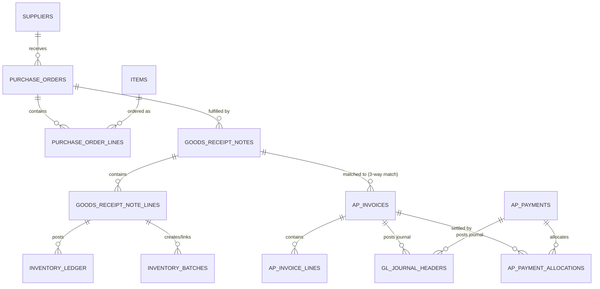

#### 4.2.2 Order-to-Cash Flow

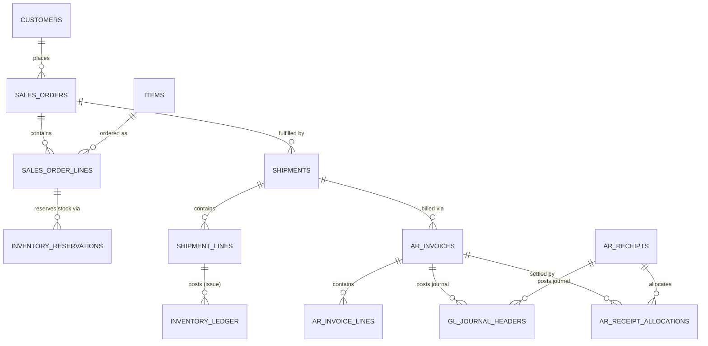

#### 4.2.3 Inventory & Warehouse Flow

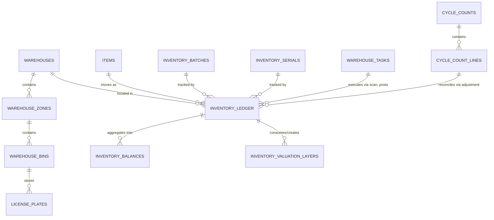

#### 4.2.4 General Ledger Posting Flow

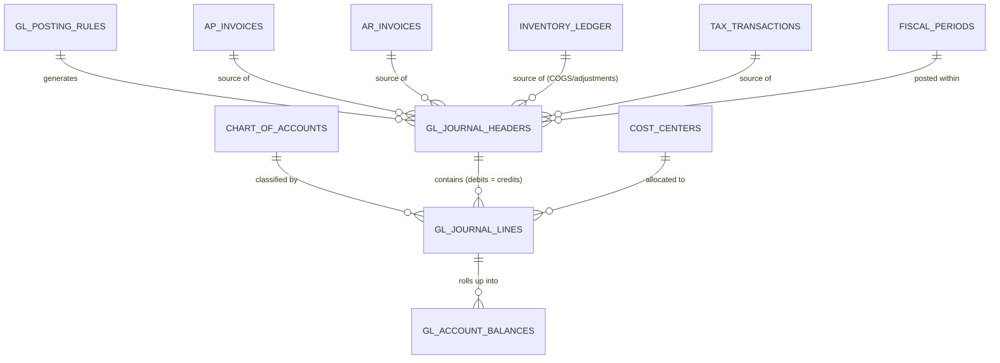

### 4.3 High-Level Cross-Domain Relationship Map

```
Tenant -> Company -> Branch -> Warehouse -> Zone -> Bin -> License Plate
Item -> Inventory Ledger -> Inventory Balance (derived)
Item -> Inventory Batch / Inventory Serial -> Inventory Ledger
Item -> Purchase Order Line -> Goods Receipt Note Line -> Inventory Ledger
Item -> Sales Order Line -> Shipment Line -> Inventory Ledger
Supplier -> Purchase Order -> Goods Receipt Note -> AP Invoice -> AP Payment
Customer -> Sales Order -> Shipment -> AR Invoice -> AR Receipt
Warehouse -> Warehouse Task -> Inventory Ledger (scan-driven movement)
Document (PO/SO/Invoice) -> Tax Transaction -> GL Journal
GL Journal Header -> GL Journal Line -> Chart of Accounts -> GL Account Balance
User -> User Role -> Role -> Role Permission -> Permission (RBAC chain)
Document -> Approval Request -> Approval Workflow -> Approval Step
```

---

## 5. Table-by-Table Schema Definitions

### 5.1 Notation & Standard Columns

Schemas below use a compact DDL-style notation: `column_name  TYPE  constraints/notes`.
**🔑** marks the primary key; **→** denotes a foreign key reference.

Every table in the system (unless explicitly noted as immutable/append-only) carries the
following **standard audit columns**, omitted from the listings below for brevity:

```
id            UUID            🔑 PK, default gen_random_uuid()
tenant_id     UUID            → tenants.id, NOT NULL   (row-level security partition key)
created_at    TIMESTAMPTZ     NOT NULL, default now()
created_by    UUID            → users.id
updated_at    TIMESTAMPTZ     NOT NULL, default now()
updated_by    UUID            → users.id
is_deleted    BOOLEAN         NOT NULL, default false   (soft delete; ledgers omit this — see §7)
```

Append-only tables (`inventory_ledger`, `gl_journal_headers`, `gl_journal_lines`,
`audit_logs`, `tax_transactions`, `e_invoices`) **omit `updated_at`/`updated_by`/
`is_deleted`** by design — they are never updated or soft-deleted, only ever inserted
(and, where required, reversed by a new offsetting entry — see §7.4 and §8.5).

### 5.2 Platform & Multi-Tenancy

```
TABLE tenants                                                       [Platform]
  id                  UUID          🔑 PK
  name                VARCHAR(255)  NOT NULL
  slug                VARCHAR(100)  NOT NULL, UNIQUE
  region              VARCHAR(50)   NOT NULL              -- data-residency region
  status              ENUM          ('TRIAL','ACTIVE','SUSPENDED','CLOSED')
  plan_id             UUID          → tenant_subscriptions.id
  created_at / updated_at

TABLE companies                                                     [Platform]
  id                  UUID          🔑 PK
  tenant_id           UUID          → tenants.id, NOT NULL
  legal_name          VARCHAR(255)  NOT NULL
  base_currency_id    UUID          → currencies.id, NOT NULL
  tax_registration_no VARCHAR(32)   -- e.g., GSTIN / VAT number of the legal entity
  fiscal_year_start   SMALLINT      NOT NULL              -- month (1-12)
  address_id          UUID          → addresses.id
  status              ENUM          ('ACTIVE','INACTIVE')

TABLE fiscal_periods                                                [Platform]
  id                  UUID          🔑 PK
  company_id          UUID          → companies.id, NOT NULL
  fiscal_year_id      UUID          → fiscal_years.id, NOT NULL
  period_no           SMALLINT      NOT NULL              -- 1-12 (or 1-13)
  start_date          DATE          NOT NULL
  end_date            DATE          NOT NULL
  status              ENUM          ('OPEN','SOFT_CLOSE','CLOSED','LOCKED')
  UNIQUE (company_id, fiscal_year_id, period_no)

TABLE number_sequences                                              [Platform]
  id                  UUID          🔑 PK
  company_id          UUID          → companies.id, NOT NULL
  document_type       VARCHAR(50)   NOT NULL              -- 'PURCHASE_ORDER','AR_INVOICE',...
  prefix_template     VARCHAR(50)   NOT NULL              -- e.g., 'PO-{YYYY}-'
  next_value          BIGINT        NOT NULL, default 1
  padding             SMALLINT      NOT NULL, default 5
  UNIQUE (company_id, document_type)
```

### 5.3 Security & RBAC

```
TABLE users                                                         [Security]
  id                  UUID          🔑 PK
  tenant_id           UUID          → tenants.id, NOT NULL
  email               VARCHAR(255)  NOT NULL, UNIQUE (tenant_id, email)
  password_hash       VARCHAR(255)  -- null if SSO-only
  full_name           VARCHAR(255)  NOT NULL
  phone               VARCHAR(32)
  mfa_enabled         BOOLEAN       NOT NULL, default false
  status              ENUM          ('INVITED','ACTIVE','DISABLED')
  last_login_at       TIMESTAMPTZ

TABLE roles                                                         [Security]
  id                  UUID          🔑 PK
  tenant_id           UUID          → tenants.id, NOT NULL
  name                VARCHAR(100)  NOT NULL, UNIQUE (tenant_id, name)
  description         TEXT
  is_system_role      BOOLEAN       NOT NULL, default false   -- platform-defined, not editable

TABLE permissions                                                   [Security]
  id                  UUID          🔑 PK
  code                VARCHAR(150)  NOT NULL, UNIQUE      -- e.g., 'procurement.purchase_order.approve'
  module              VARCHAR(50)   NOT NULL
  action              VARCHAR(50)   NOT NULL              -- 'create','read','update','delete','approve','export'
  description         TEXT

TABLE role_permissions                                              [Security]
  id                  UUID          🔑 PK
  role_id             UUID          → roles.id, NOT NULL
  permission_id       UUID          → permissions.id, NOT NULL
  scope               ENUM          ('TENANT','COMPANY','BRANCH','WAREHOUSE','OWN')
  condition_expr      JSONB         -- ABAC overlay: {"max_amount": 50000, "item_categories": [...],
                                    --  "time_window": {...}, "exclude_if_requested_by_self": true}  (§12.5)
  UNIQUE (role_id, permission_id, scope)

TABLE user_roles                                                    [Security]
  id                  UUID          🔑 PK
  user_id             UUID          → users.id, NOT NULL
  role_id             UUID          → roles.id, NOT NULL
  company_id          UUID          → companies.id          -- NULL = all companies in tenant
  branch_id           UUID          → branches.id           -- NULL = all branches in company
  warehouse_id        UUID          → warehouses.id         -- NULL = all warehouses
  UNIQUE (user_id, role_id, company_id, branch_id, warehouse_id)

TABLE audit_logs                                          [Security · APPEND-ONLY]
  id                  UUID          🔑 PK
  tenant_id           UUID          → tenants.id, NOT NULL
  actor_user_id       UUID          → users.id
  actor_type          ENUM          ('USER','SYSTEM','API_KEY','AI_AGENT')
  action              VARCHAR(100)  NOT NULL              -- 'CREATE','UPDATE','DELETE','APPROVE','LOGIN',...
  entity_type         VARCHAR(100)  NOT NULL              -- table/aggregate name
  entity_id           UUID          NOT NULL
  before_state        JSONB
  after_state         JSONB
  ip_address          INET
  occurred_at         TIMESTAMPTZ   NOT NULL, default now()
  -- INSERT-only; no update/delete grants at the DB-role level (see §12.11)

TABLE sod_conflict_rules                                            [Security · SoD]
  id                  UUID          🔑 PK
  tenant_id           UUID          → tenants.id, NOT NULL
  name                VARCHAR(150)  NOT NULL              -- "Maker-checker: AP invoice vs payment"
  permission_a_code   VARCHAR(150)  → permissions.code, NOT NULL
  permission_b_code   VARCHAR(150)  → permissions.code, NOT NULL
  conflict_type       ENUM          ('HARD_BLOCK','SOFT_WARN_REQUIRES_WAIVER')
  rationale           TEXT          NOT NULL              -- shown to admins/auditors at assignment time
  UNIQUE (tenant_id, permission_a_code, permission_b_code)

TABLE sod_violations                                                [Security · SoD]
  id                  UUID          🔑 PK
  tenant_id           UUID          → tenants.id, NOT NULL
  user_id             UUID          → users.id, NOT NULL
  conflict_rule_id    UUID          → sod_conflict_rules.id, NOT NULL
  detected_at         TIMESTAMPTZ   NOT NULL, default now()
  detection_source    ENUM          ('ASSIGNMENT_TIME','RUNTIME_SCAN','PERIODIC_AUDIT')
  status              ENUM          ('OPEN','ACCEPTED_RISK','REMEDIATED','FALSE_POSITIVE')
  resolution_notes    TEXT
  resolved_by         UUID          → users.id
  resolved_at         TIMESTAMPTZ

TABLE role_delegations                                              [Security · Delegation]
  id                  UUID          🔑 PK
  delegator_user_id   UUID          → users.id, NOT NULL   -- person temporarily handing off access
  delegate_user_id    UUID          → users.id, NOT NULL   -- person temporarily receiving it
  role_id             UUID          → roles.id, NOT NULL
  scope_company_id    UUID          → companies.id
  scope_warehouse_id  UUID          → warehouses.id
  starts_at           TIMESTAMPTZ   NOT NULL
  ends_at             TIMESTAMPTZ   NOT NULL
  reason              VARCHAR(255)  -- e.g. "Annual leave coverage 2026-06-15..2026-06-29"
  status              ENUM          ('SCHEDULED','ACTIVE','EXPIRED','REVOKED')
  approved_by         UUID          → users.id            -- required for sensitive roles, see §12.7
  CHECK (ends_at > starts_at)
```

### 5.4 Master Data

```
TABLE items                                                         [Master Data]
  id                  UUID          🔑 PK
  company_id          UUID          → companies.id, NOT NULL
  sku                 VARCHAR(64)   NOT NULL, UNIQUE (company_id, sku)
  name                VARCHAR(255)  NOT NULL
  category_id         UUID          → item_categories.id
  base_uom_id         UUID          → units_of_measure.id, NOT NULL
  hsn_sac_code        VARCHAR(16)   → hsn_sac_codes.code
  item_type           ENUM          ('GOODS','SERVICE','ASSET'), default 'GOODS'
  valuation_method    ENUM          ('FIFO','LIFO','WEIGHTED_AVG'), default 'FIFO'
  is_batch_tracked    BOOLEAN       NOT NULL, default false
  is_serial_tracked   BOOLEAN       NOT NULL, default false
  shelf_life_days     INTEGER
  reorder_point       NUMERIC(18,4)
  reorder_quantity    NUMERIC(18,4)
  status              ENUM          ('ACTIVE','INACTIVE','DISCONTINUED')

TABLE item_categories                                               [Master Data]
  id                  UUID          🔑 PK
  company_id          UUID          → companies.id, NOT NULL
  parent_category_id  UUID          → item_categories.id   -- self-referencing hierarchy
  name                VARCHAR(150)  NOT NULL
  path                LTREE                                 -- materialized path for fast subtree queries

TABLE units_of_measure                                              [Master Data]
  id                  UUID          🔑 PK
  code                VARCHAR(16)   NOT NULL, UNIQUE       -- 'EA','KG','BOX'
  name                VARCHAR(50)   NOT NULL
  uom_class           ENUM          ('COUNT','WEIGHT','VOLUME','LENGTH','TIME')

TABLE uom_conversions                                               [Master Data]
  id                  UUID          🔑 PK
  item_id             UUID          → items.id, NOT NULL
  from_uom_id         UUID          → units_of_measure.id, NOT NULL
  to_uom_id           UUID          → units_of_measure.id, NOT NULL
  conversion_factor   NUMERIC(18,8) NOT NULL              -- 1 from_uom = factor * to_uom
  UNIQUE (item_id, from_uom_id, to_uom_id)

TABLE price_lists                                                   [Master Data]
  id                  UUID          🔑 PK
  company_id          UUID          → companies.id, NOT NULL
  name                VARCHAR(150)  NOT NULL
  currency_id         UUID          → currencies.id, NOT NULL
  price_type          ENUM          ('SALES','PURCHASE')
  valid_from          DATE
  valid_to            DATE
  status              ENUM          ('DRAFT','ACTIVE','EXPIRED')

TABLE price_list_items                                              [Master Data]
  id                  UUID          🔑 PK
  price_list_id       UUID          → price_lists.id, NOT NULL
  item_id             UUID          → items.id, NOT NULL
  uom_id              UUID          → units_of_measure.id, NOT NULL
  unit_price          NUMERIC(18,4) NOT NULL
  min_quantity        NUMERIC(18,4) NOT NULL, default 0   -- volume-pricing breakpoints
  UNIQUE (price_list_id, item_id, uom_id, min_quantity)

TABLE tax_codes                                                     [Master Data]
  id                  UUID          🔑 PK
  company_id          UUID          → companies.id, NOT NULL
  code                VARCHAR(32)   NOT NULL, UNIQUE (company_id, code)   -- 'GST18','VAT20'
  name                VARCHAR(100)  NOT NULL
  tax_type            ENUM          ('GST','VAT','SALES_TAX','WITHHOLDING','CUSTOM')
  is_compound         BOOLEAN       NOT NULL, default false

TABLE tax_rates                                                     [Master Data]
  id                  UUID          🔑 PK
  tax_code_id         UUID          → tax_codes.id, NOT NULL
  component_name      VARCHAR(50)   NOT NULL              -- 'CGST','SGST','IGST','CESS'
  rate_percent        NUMERIC(7,4)  NOT NULL
  effective_from      DATE          NOT NULL
  effective_to        DATE
  gl_account_id       UUID          → chart_of_accounts.id, NOT NULL  -- where collected tax posts
```

### 5.5 Supplier & Customer Management

```
TABLE suppliers                                                     [Supplier Mgmt]
  id                  UUID          🔑 PK
  company_id          UUID          → companies.id, NOT NULL
  code                VARCHAR(32)   NOT NULL, UNIQUE (company_id, code)
  legal_name          VARCHAR(255)  NOT NULL
  default_currency_id UUID          → currencies.id, NOT NULL
  payment_term_id     UUID          → payment_terms.id
  default_ap_account  UUID          → chart_of_accounts.id
  rating_score        NUMERIC(4,2)
  status              ENUM          ('PENDING_APPROVAL','ACTIVE','BLOCKED')

TABLE customers                                                     [Customer Mgmt]
  id                  UUID          🔑 PK
  company_id          UUID          → companies.id, NOT NULL
  code                VARCHAR(32)   NOT NULL, UNIQUE (company_id, code)
  legal_name          VARCHAR(255)  NOT NULL
  default_currency_id UUID          → currencies.id, NOT NULL
  price_list_id       UUID          → price_lists.id
  default_ar_account  UUID          → chart_of_accounts.id
  status              ENUM          ('ACTIVE','INACTIVE','BLOCKED')

TABLE customer_credit_profiles                                      [Customer Mgmt]
  id                  UUID          🔑 PK
  customer_id         UUID          → customers.id, NOT NULL, UNIQUE
  credit_limit        NUMERIC(18,2) NOT NULL, default 0
  payment_term_id     UUID          → payment_terms.id
  on_credit_hold      BOOLEAN       NOT NULL, default false
  hold_reason         TEXT
  reviewed_at         TIMESTAMPTZ
  reviewed_by         UUID          → users.id
```

### 5.6 Procurement

```
TABLE purchase_orders                                               [Procurement]
  id                  UUID          🔑 PK
  company_id          UUID          → companies.id, NOT NULL
  po_number           VARCHAR(32)   NOT NULL, UNIQUE (company_id, po_number)
  supplier_id         UUID          → suppliers.id, NOT NULL
  warehouse_id        UUID          → warehouses.id, NOT NULL   -- ship-to
  currency_id         UUID          → currencies.id, NOT NULL
  fx_rate             NUMERIC(18,8) NOT NULL, default 1
  order_date          DATE          NOT NULL
  expected_date       DATE
  status              ENUM          ('DRAFT','PENDING_APPROVAL','APPROVED','PARTIALLY_RECEIVED','RECEIVED','CLOSED','CANCELLED')
  subtotal_amount     NUMERIC(18,2) NOT NULL, default 0
  tax_amount          NUMERIC(18,2) NOT NULL, default 0
  total_amount        NUMERIC(18,2) NOT NULL, default 0
  approved_by         UUID          → users.id
  approved_at         TIMESTAMPTZ

TABLE purchase_order_lines                                          [Procurement]
  id                  UUID          🔑 PK
  purchase_order_id   UUID          → purchase_orders.id, NOT NULL
  line_no             SMALLINT      NOT NULL
  item_id             UUID          → items.id, NOT NULL
  uom_id              UUID          → units_of_measure.id, NOT NULL
  quantity_ordered    NUMERIC(18,4) NOT NULL
  quantity_received   NUMERIC(18,4) NOT NULL, default 0      -- denormalized rollup from GRN lines
  unit_price          NUMERIC(18,4) NOT NULL
  tax_code_id         UUID          → tax_codes.id
  line_total          NUMERIC(18,2) NOT NULL
  UNIQUE (purchase_order_id, line_no)

TABLE goods_receipt_notes                                           [Procurement]
  id                  UUID          🔑 PK
  company_id          UUID          → companies.id, NOT NULL
  grn_number          VARCHAR(32)   NOT NULL, UNIQUE (company_id, grn_number)
  purchase_order_id   UUID          → purchase_orders.id, NOT NULL
  warehouse_id        UUID          → warehouses.id, NOT NULL
  received_date       TIMESTAMPTZ   NOT NULL
  status              ENUM          ('DRAFT','POSTED','REVERSED')
  posted_at           TIMESTAMPTZ
  posted_by           UUID          → users.id

TABLE goods_receipt_note_lines                                      [Procurement]
  id                  UUID          🔑 PK
  grn_id              UUID          → goods_receipt_notes.id, NOT NULL
  po_line_id          UUID          → purchase_order_lines.id, NOT NULL
  item_id             UUID          → items.id, NOT NULL
  quantity_received   NUMERIC(18,4) NOT NULL
  uom_id              UUID          → units_of_measure.id, NOT NULL
  unit_cost           NUMERIC(18,4) NOT NULL
  batch_id            UUID          → inventory_batches.id     -- created/linked at receipt time
  bin_id              UUID          → warehouse_bins.id        -- putaway destination
  inventory_ledger_id UUID          → inventory_ledger.id      -- the ledger entry this line generated
```

### 5.7 Warehouse Management

```
TABLE warehouses                                                    [Warehouse Mgmt]
  id                  UUID          🔑 PK
  company_id          UUID          → companies.id, NOT NULL
  code                VARCHAR(16)   NOT NULL, UNIQUE (company_id, code)
  name                VARCHAR(150)  NOT NULL
  address_id          UUID          → addresses.id
  warehouse_type      ENUM          ('DC','RETAIL_BACKROOM','MANUFACTURING','BONDED','VIRTUAL')
  timezone            VARCHAR(64)   NOT NULL, default 'UTC'

TABLE warehouse_bins                                                [Warehouse Mgmt]
  id                  UUID          🔑 PK
  warehouse_id        UUID          → warehouses.id, NOT NULL
  zone_id             UUID          → warehouse_zones.id, NOT NULL
  code                VARCHAR(32)   NOT NULL              -- human/barcode label, e.g. 'A-01-03-B'
  barcode             VARCHAR(64)   UNIQUE                -- printed/scanned identifier
  bin_type            ENUM          ('PICK_FACE','BULK_STORAGE','STAGING','RETURNS','QUARANTINE')
  capacity_uom_id     UUID          → units_of_measure.id
  capacity_qty        NUMERIC(18,4)
  is_pickable         BOOLEAN       NOT NULL, default true
  UNIQUE (warehouse_id, code)

TABLE license_plates                                                [Warehouse Mgmt]
  id                  UUID          🔑 PK
  lp_code             VARCHAR(32)   NOT NULL, UNIQUE     -- printed pallet/container barcode (LPN)
  warehouse_id        UUID          → warehouses.id, NOT NULL
  current_bin_id      UUID          → warehouse_bins.id
  status              ENUM          ('OPEN','CLOSED','IN_TRANSIT','CONSUMED')
  parent_lp_id        UUID          → license_plates.id   -- nested pallets/cases

TABLE warehouse_tasks                                               [Warehouse Mgmt]
  id                  UUID          🔑 PK
  warehouse_id        UUID          → warehouses.id, NOT NULL
  task_type           ENUM          ('PUTAWAY','PICK','REPLENISH','COUNT','MOVE')
  source_document_type VARCHAR(50)  -- 'GRN','SALES_ORDER','TRANSFER','CYCLE_COUNT'
  source_document_id  UUID          NOT NULL
  item_id             UUID          → items.id
  from_bin_id         UUID          → warehouse_bins.id
  to_bin_id           UUID          → warehouse_bins.id
  quantity            NUMERIC(18,4)
  assigned_to         UUID          → users.id
  status              ENUM          ('PENDING','ASSIGNED','IN_PROGRESS','COMPLETED','CANCELLED')
  scanned_at          TIMESTAMPTZ
  device_id           VARCHAR(64)   -- scanner/handheld identifier (offline-sync correlation)
```

### 5.8 Inventory Management — the Core Ledger Domain

```
TABLE inventory_ledger                                [Inventory · APPEND-ONLY]
  id                  UUID          🔑 PK
  company_id          UUID          → companies.id, NOT NULL
  entry_no            BIGINT        NOT NULL, UNIQUE (company_id, entry_no)  -- monotonic, gapless per company
  item_id             UUID          → items.id, NOT NULL
  warehouse_id        UUID          → warehouses.id, NOT NULL
  bin_id              UUID          → warehouse_bins.id
  batch_id            UUID          → inventory_batches.id
  serial_id           UUID          → inventory_serials.id
  movement_type       ENUM          ('RECEIPT','ISSUE','TRANSFER_OUT','TRANSFER_IN',
                                       'ADJUSTMENT_POSITIVE','ADJUSTMENT_NEGATIVE',
                                       'RESERVATION','RESERVATION_RELEASE','RETURN_IN','RETURN_OUT')
  quantity            NUMERIC(18,4) NOT NULL          -- signed: +in / -out
  uom_id              UUID          → units_of_measure.id, NOT NULL
  unit_cost           NUMERIC(18,6) NOT NULL          -- cost at time of movement (valuation layer link)
  valuation_layer_id  UUID          → inventory_valuation_layers.id
  source_document_type VARCHAR(50)  NOT NULL          -- 'GRN','SHIPMENT','TRANSFER','ADJUSTMENT',...
  source_document_id  UUID          NOT NULL
  source_line_id      UUID                            -- line-level traceability
  reason_code         VARCHAR(50)
  reverses_entry_id   UUID          → inventory_ledger.id   -- self-ref for correction entries (§7.4)
  occurred_at         TIMESTAMPTZ   NOT NULL, default now()
  created_by          UUID          → users.id
  -- INSERT-only. No UPDATE/DELETE grants at DB-role level. Corrections = new offsetting rows.
  -- INDEX (item_id, warehouse_id, occurred_at), (batch_id), (serial_id), (source_document_type, source_document_id)

TABLE inventory_balances                          [Inventory · DERIVED / MATERIALIZED]
  id                  UUID          🔑 PK
  item_id             UUID          → items.id, NOT NULL
  warehouse_id        UUID          → warehouses.id, NOT NULL
  bin_id              UUID          → warehouse_bins.id
  batch_id            UUID          → inventory_batches.id
  quantity_on_hand    NUMERIC(18,4) NOT NULL, default 0   -- Σ inventory_ledger.quantity
  quantity_reserved   NUMERIC(18,4) NOT NULL, default 0   -- Σ active inventory_reservations
  quantity_available  NUMERIC(18,4) GENERATED ALWAYS AS (quantity_on_hand - quantity_reserved) STORED
  last_ledger_entry_no BIGINT       NOT NULL          -- watermark: last ledger row folded into this balance
  recalculated_at     TIMESTAMPTZ   NOT NULL
  UNIQUE (item_id, warehouse_id, bin_id, batch_id)
  -- Rebuilt by replaying inventory_ledger from last_ledger_entry_no — never the source of truth (§7.3)

TABLE inventory_batches                                             [Inventory]
  id                  UUID          🔑 PK
  item_id             UUID          → items.id, NOT NULL
  batch_no            VARCHAR(64)   NOT NULL
  supplier_lot_no     VARCHAR(64)
  manufactured_date   DATE
  expiry_date         DATE
  supplier_id         UUID          → suppliers.id
  status              ENUM          ('ACTIVE','QUARANTINE','EXPIRED','RECALLED')
  UNIQUE (item_id, batch_no)

TABLE inventory_serials                                             [Inventory]
  id                  UUID          🔑 PK
  item_id             UUID          → items.id, NOT NULL
  serial_no           VARCHAR(128)  NOT NULL, UNIQUE (item_id, serial_no)
  batch_id            UUID          → inventory_batches.id
  current_status      ENUM          ('IN_STOCK','RESERVED','SHIPPED','RETURNED','SCRAPPED')
  current_warehouse_id UUID         → warehouses.id
  current_bin_id      UUID          → warehouse_bins.id
  warranty_expiry     DATE

TABLE inventory_reservations                                        [Inventory]
  id                  UUID          🔑 PK
  item_id             UUID          → items.id, NOT NULL
  warehouse_id        UUID          → warehouses.id, NOT NULL
  batch_id            UUID          → inventory_batches.id
  quantity            NUMERIC(18,4) NOT NULL
  source_document_type VARCHAR(50)  NOT NULL          -- 'SALES_ORDER_LINE','TRANSFER_LINE'
  source_document_id  UUID          NOT NULL
  status              ENUM          ('ACTIVE','RELEASED','FULFILLED','EXPIRED')
  expires_at          TIMESTAMPTZ

TABLE stock_adjustments                                             [Inventory]
  id                  UUID          🔑 PK
  company_id          UUID          → companies.id, NOT NULL
  adjustment_no       VARCHAR(32)   NOT NULL, UNIQUE (company_id, adjustment_no)
  warehouse_id        UUID          → warehouses.id, NOT NULL
  reason_code         VARCHAR(50)   NOT NULL          -- 'DAMAGE','WRITE_OFF','FOUND_STOCK','COUNT_VARIANCE'
  status              ENUM          ('DRAFT','PENDING_APPROVAL','POSTED','REJECTED')
  approved_by         UUID          → users.id
  posted_at           TIMESTAMPTZ

TABLE inventory_valuation_layers                                    [Inventory]
  id                  UUID          🔑 PK
  item_id             UUID          → items.id, NOT NULL
  warehouse_id        UUID          → warehouses.id, NOT NULL
  receipt_ledger_id   UUID          → inventory_ledger.id, NOT NULL   -- the RECEIPT that created this layer
  original_quantity   NUMERIC(18,4) NOT NULL
  remaining_quantity  NUMERIC(18,4) NOT NULL          -- decremented as ISSUE entries consume the layer (FIFO/LIFO)
  unit_cost           NUMERIC(18,6) NOT NULL
  received_at         TIMESTAMPTZ   NOT NULL
  -- For WEIGHTED_AVG-valued items, layers collapse into a single rolling-average row per item/warehouse
```

### 5.9 Sales & Distribution

```
TABLE sales_orders                                                  [Sales]
  id                  UUID          🔑 PK
  company_id          UUID          → companies.id, NOT NULL
  so_number           VARCHAR(32)   NOT NULL, UNIQUE (company_id, so_number)
  customer_id         UUID          → customers.id, NOT NULL
  warehouse_id        UUID          → warehouses.id, NOT NULL   -- ship-from
  currency_id         UUID          → currencies.id, NOT NULL
  fx_rate             NUMERIC(18,8) NOT NULL, default 1
  order_date          DATE          NOT NULL
  promised_date       DATE
  status              ENUM          ('DRAFT','CONFIRMED','ALLOCATED','PARTIALLY_SHIPPED','SHIPPED','INVOICED','CLOSED','CANCELLED')
  credit_check_status ENUM          ('PASSED','OVERRIDDEN','BLOCKED')
  subtotal_amount     NUMERIC(18,2) NOT NULL, default 0
  tax_amount          NUMERIC(18,2) NOT NULL, default 0
  total_amount        NUMERIC(18,2) NOT NULL, default 0

TABLE sales_order_lines                                             [Sales]
  id                  UUID          🔑 PK
  sales_order_id      UUID          → sales_orders.id, NOT NULL
  line_no             SMALLINT      NOT NULL
  item_id             UUID          → items.id, NOT NULL
  uom_id              UUID          → units_of_measure.id, NOT NULL
  quantity_ordered    NUMERIC(18,4) NOT NULL
  quantity_allocated  NUMERIC(18,4) NOT NULL, default 0
  quantity_shipped    NUMERIC(18,4) NOT NULL, default 0
  unit_price          NUMERIC(18,4) NOT NULL
  tax_code_id         UUID          → tax_codes.id
  line_total          NUMERIC(18,2) NOT NULL
  promised_date       DATE
  UNIQUE (sales_order_id, line_no)

TABLE shipments                                                     [Sales]
  id                  UUID          🔑 PK
  company_id          UUID          → companies.id, NOT NULL
  shipment_no         VARCHAR(32)   NOT NULL, UNIQUE (company_id, shipment_no)
  sales_order_id      UUID          → sales_orders.id, NOT NULL
  warehouse_id        UUID          → warehouses.id, NOT NULL
  carrier_name        VARCHAR(150)
  tracking_number     VARCHAR(100)
  shipped_at          TIMESTAMPTZ
  status              ENUM          ('PLANNED','PICKED','PACKED','SHIPPED','DELIVERED','RETURNED')
```

### 5.10 GST / Taxation

```
TABLE tax_transactions                                  [Taxation · APPEND-ONLY]
  id                  UUID          🔑 PK
  company_id          UUID          → companies.id, NOT NULL
  source_document_type VARCHAR(50)  NOT NULL          -- 'PURCHASE_ORDER','AR_INVOICE','AP_INVOICE',...
  source_document_id  UUID          NOT NULL
  source_line_id      UUID
  tax_code_id         UUID          → tax_codes.id, NOT NULL
  tax_component       VARCHAR(50)   NOT NULL          -- 'CGST','SGST','IGST','CESS','VAT'
  taxable_amount      NUMERIC(18,2) NOT NULL
  tax_rate_percent    NUMERIC(7,4)  NOT NULL
  tax_amount          NUMERIC(18,2) NOT NULL
  place_of_supply     VARCHAR(100)
  hsn_sac_code        VARCHAR(16)   → hsn_sac_codes.code
  gl_journal_line_id  UUID          → gl_journal_lines.id  -- where this tax amount posted
```

### 5.11 Accounts Payable / Accounts Receivable

```
TABLE ap_invoices                                                   [AP]
  id                  UUID          🔑 PK
  company_id          UUID          → companies.id, NOT NULL
  invoice_number      VARCHAR(64)   NOT NULL          -- supplier's own invoice number
  internal_ref        VARCHAR(32)   NOT NULL, UNIQUE (company_id, internal_ref)
  supplier_id         UUID          → suppliers.id, NOT NULL
  grn_id              UUID          → goods_receipt_notes.id   -- 3-way match anchor
  purchase_order_id   UUID          → purchase_orders.id
  invoice_date        DATE          NOT NULL
  due_date            DATE          NOT NULL
  currency_id         UUID          → currencies.id, NOT NULL
  subtotal_amount     NUMERIC(18,2) NOT NULL
  tax_amount          NUMERIC(18,2) NOT NULL
  total_amount        NUMERIC(18,2) NOT NULL
  amount_paid         NUMERIC(18,2) NOT NULL, default 0
  status              ENUM          ('DRAFT','MATCHED','APPROVED','PARTIALLY_PAID','PAID','DISPUTED','CANCELLED')
  gl_journal_id       UUID          → gl_journal_headers.id

TABLE ap_invoice_lines                                              [AP]
  id                  UUID          🔑 PK
  ap_invoice_id       UUID          → ap_invoices.id, NOT NULL
  po_line_id          UUID          → purchase_order_lines.id
  item_id             UUID          → items.id
  description         VARCHAR(255)
  quantity            NUMERIC(18,4) NOT NULL
  unit_price          NUMERIC(18,4) NOT NULL
  tax_code_id         UUID          → tax_codes.id
  expense_account_id  UUID          → chart_of_accounts.id  -- for non-stock / service lines
  line_total          NUMERIC(18,2) NOT NULL

TABLE ap_payments                                                   [AP]
  id                  UUID          🔑 PK
  company_id          UUID          → companies.id, NOT NULL
  payment_no          VARCHAR(32)   NOT NULL, UNIQUE (company_id, payment_no)
  supplier_id         UUID          → suppliers.id, NOT NULL
  payment_date        DATE          NOT NULL
  payment_mode        ENUM          ('BANK_TRANSFER','CHEQUE','CARD','CASH','UPI')
  bank_account_id     UUID          → company_bank_accounts.id
  amount              NUMERIC(18,2) NOT NULL
  currency_id         UUID          → currencies.id, NOT NULL
  status              ENUM          ('DRAFT','ISSUED','CLEARED','VOIDED')
  gl_journal_id       UUID          → gl_journal_headers.id

TABLE ar_invoices                                                   [AR]
  id                  UUID          🔑 PK
  company_id          UUID          → companies.id, NOT NULL
  invoice_number      VARCHAR(32)   NOT NULL, UNIQUE (company_id, invoice_number)
  customer_id         UUID          → customers.id, NOT NULL
  shipment_id         UUID          → shipments.id
  sales_order_id      UUID          → sales_orders.id
  invoice_date        DATE          NOT NULL
  due_date            DATE          NOT NULL
  currency_id         UUID          → currencies.id, NOT NULL
  subtotal_amount     NUMERIC(18,2) NOT NULL
  tax_amount          NUMERIC(18,2) NOT NULL
  total_amount        NUMERIC(18,2) NOT NULL
  amount_received     NUMERIC(18,2) NOT NULL, default 0
  status              ENUM          ('DRAFT','ISSUED','PARTIALLY_PAID','PAID','OVERDUE','CANCELLED','CREDITED')
  e_invoice_id        UUID          → e_invoices.id
  gl_journal_id       UUID          → gl_journal_headers.id

TABLE ar_invoice_lines                                              [AR]
  id                  UUID          🔑 PK
  ar_invoice_id       UUID          → ar_invoices.id, NOT NULL
  so_line_id          UUID          → sales_order_lines.id
  item_id             UUID          → items.id
  description         VARCHAR(255)
  quantity            NUMERIC(18,4) NOT NULL
  unit_price          NUMERIC(18,4) NOT NULL
  tax_code_id         UUID          → tax_codes.id
  revenue_account_id  UUID          → chart_of_accounts.id
  line_total          NUMERIC(18,2) NOT NULL

TABLE ar_receipts                                                   [AR]
  id                  UUID          🔑 PK
  company_id          UUID          → companies.id, NOT NULL
  receipt_no          VARCHAR(32)   NOT NULL, UNIQUE (company_id, receipt_no)
  customer_id         UUID          → customers.id, NOT NULL
  receipt_date        DATE          NOT NULL
  payment_mode        ENUM          ('BANK_TRANSFER','CHEQUE','CARD','CASH','UPI')
  bank_account_id     UUID          → company_bank_accounts.id
  amount              NUMERIC(18,2) NOT NULL
  currency_id         UUID          → currencies.id, NOT NULL
  status              ENUM          ('DRAFT','CLEARED','BOUNCED','VOIDED')
  gl_journal_id       UUID          → gl_journal_headers.id
```

### 5.12 General Ledger

```
TABLE chart_of_accounts                                             [GL]
  id                  UUID          🔑 PK
  company_id          UUID          → companies.id, NOT NULL
  account_code        VARCHAR(32)   NOT NULL, UNIQUE (company_id, account_code)
  name                VARCHAR(150)  NOT NULL
  account_type        ENUM          ('ASSET','LIABILITY','EQUITY','REVENUE','EXPENSE')
  account_subtype     VARCHAR(50)   -- 'CURRENT_ASSET','COGS','ACCRUED_LIABILITY',...
  parent_account_id   UUID          → chart_of_accounts.id   -- self-referencing hierarchy
  currency_id         UUID          → currencies.id
  is_control_account  BOOLEAN       NOT NULL, default false  -- e.g., AP/AR control — posted only via sub-ledger
  is_active           BOOLEAN       NOT NULL, default true

TABLE gl_journal_headers                                [GL · APPEND-ONLY]
  id                  UUID          🔑 PK
  company_id          UUID          → companies.id, NOT NULL
  journal_no          VARCHAR(32)   NOT NULL, UNIQUE (company_id, journal_no)
  fiscal_period_id    UUID          → fiscal_periods.id, NOT NULL
  journal_date        DATE          NOT NULL
  source_module       VARCHAR(50)   NOT NULL          -- 'AP','AR','INVENTORY','TAX','MANUAL'
  source_document_type VARCHAR(50)
  source_document_id  UUID
  posting_rule_id     UUID          → gl_posting_rules.id
  description         TEXT
  status              ENUM          ('DRAFT','POSTED','REVERSED')
  total_debit         NUMERIC(18,2) NOT NULL          -- CHECK (total_debit = total_credit)
  total_credit        NUMERIC(18,2) NOT NULL
  reverses_journal_id UUID          → gl_journal_headers.id   -- self-ref for reversal entries (§8.5)
  posted_at           TIMESTAMPTZ
  posted_by           UUID          → users.id

TABLE gl_journal_lines                                  [GL · APPEND-ONLY]
  id                  UUID          🔑 PK
  journal_header_id   UUID          → gl_journal_headers.id, NOT NULL
  line_no             SMALLINT      NOT NULL
  account_id          UUID          → chart_of_accounts.id, NOT NULL
  cost_center_id      UUID          → cost_centers.id
  debit_amount        NUMERIC(18,2) NOT NULL, default 0
  credit_amount       NUMERIC(18,2) NOT NULL, default 0  -- CHECK (debit = 0 XOR credit = 0)
  currency_id         UUID          → currencies.id, NOT NULL
  fx_rate             NUMERIC(18,8) NOT NULL, default 1
  base_amount         NUMERIC(18,2) NOT NULL          -- amount in company base currency
  memo                VARCHAR(255)
  UNIQUE (journal_header_id, line_no)

TABLE gl_account_balances                       [GL · DERIVED / MATERIALIZED]
  id                  UUID          🔑 PK
  company_id          UUID          → companies.id, NOT NULL
  account_id          UUID          → chart_of_accounts.id, NOT NULL
  cost_center_id      UUID          → cost_centers.id
  fiscal_period_id    UUID          → fiscal_periods.id, NOT NULL
  opening_balance     NUMERIC(18,2) NOT NULL
  period_debit        NUMERIC(18,2) NOT NULL
  period_credit       NUMERIC(18,2) NOT NULL
  closing_balance     NUMERIC(18,2) GENERATED ALWAYS AS
                        (opening_balance + period_debit - period_credit) STORED
  UNIQUE (account_id, cost_center_id, fiscal_period_id)
  -- Rebuilt by aggregating gl_journal_lines for the period — never the source of truth (§8.4)

TABLE gl_posting_rules                                              [GL]
  id                  UUID          🔑 PK
  company_id          UUID          → companies.id, NOT NULL
  event_code          VARCHAR(100)  NOT NULL          -- 'GRN_POSTED','AR_INVOICE_ISSUED','COGS_ON_SHIPMENT',...
  debit_account_id    UUID          → chart_of_accounts.id, NOT NULL
  credit_account_id   UUID          → chart_of_accounts.id, NOT NULL
  condition_expr      JSONB                            -- optional rule-matching conditions (item category, tax type, ...)
  priority            SMALLINT      NOT NULL, default 100
  UNIQUE (company_id, event_code, priority)
```

### 5.13 AI / ML & Workflow

```
TABLE ai_forecasts                                                  [AI/ML]
  id                  UUID          🔑 PK
  company_id          UUID          → companies.id, NOT NULL
  item_id             UUID          → items.id, NOT NULL
  warehouse_id        UUID          → warehouses.id, NOT NULL
  forecast_date       DATE          NOT NULL          -- the period being forecasted
  horizon_days        SMALLINT      NOT NULL
  predicted_quantity  NUMERIC(18,4) NOT NULL
  confidence_low      NUMERIC(18,4)
  confidence_high     NUMERIC(18,4)
  model_run_id        UUID          → ai_model_runs.id, NOT NULL
  generated_at        TIMESTAMPTZ   NOT NULL

TABLE ai_recommendations                                            [AI/ML]
  id                  UUID          🔑 PK
  company_id          UUID          → companies.id, NOT NULL
  recommendation_type ENUM          ('REORDER','PRICE_ADJUST','SUPPLIER_SWITCH','SLOW_MOVER_CLEARANCE','ROUTE_OPTIMIZATION')
  entity_type         VARCHAR(50)   NOT NULL          -- 'ITEM','SUPPLIER','SALES_ORDER',...
  entity_id           UUID          NOT NULL
  payload             JSONB         NOT NULL          -- structured suggestion (qty, supplier, price, rationale)
  confidence_score    NUMERIC(5,4)
  status              ENUM          ('PROPOSED','ACCEPTED','REJECTED','AUTO_APPLIED','EXPIRED')
  decided_by          UUID          → users.id
  model_run_id        UUID          → ai_model_runs.id, NOT NULL

TABLE approval_requests                                             [Workflow]
  id                  UUID          🔑 PK
  workflow_id         UUID          → approval_workflows.id, NOT NULL
  current_step_id     UUID          → approval_steps.id
  document_type       VARCHAR(50)   NOT NULL          -- 'PURCHASE_ORDER','STOCK_ADJUSTMENT',...
  document_id         UUID          NOT NULL
  requested_by        UUID          → users.id, NOT NULL
  status              ENUM          ('PENDING','APPROVED','REJECTED','CANCELLED')
  decided_by          UUID          → users.id
  decided_at          TIMESTAMPTZ
  comments            TEXT
```

---

## 6. Primary Keys / Foreign Keys — Conventions & Reference Map

### 6.1 Primary Key Strategy

| Decision | Choice | Rationale |
|---|---|---|
| Key type | **UUID v7** (time-ordered UUID) as surrogate PK on every table | Globally unique across tenants/shards, safe for offline-generated records (mobile scanners create IDs before sync), and the v7 time-ordering keeps index locality (avoids the random-UUID b-tree fragmentation problem) |
| Natural keys | Preserved as **unique constraints**, never as PKs (e.g., `(company_id, sku)` on `items`, `(company_id, po_number)` on `purchase_orders`) | Business identifiers can be renumbered/corrected without cascading PK changes |
| Ledger sequence | `inventory_ledger.entry_no` and `gl_journal_headers.journal_no` are **monotonic, gapless, per-company sequences** in addition to the UUID PK | Statutory requirements (e.g., GST invoice sequencing) and ledger-replay/audit demand a strict, contiguous ordering that UUIDs (even v7) do not guarantee under concurrent inserts |
| High-volume children | `inventory_ledger`, `gl_journal_lines`, `audit_logs`, `tax_transactions` are **range-partitioned by `(company_id, occurred_at / journal_date)`** | Keeps indexes small, enables cheap retention/archival of old partitions, and lets the query planner prune partitions for period-bounded reports |

### 6.2 Foreign Key Conventions

- **Naming**: `<referenced_table_singular>_id` (e.g., `supplier_id → suppliers.id`,
  `warehouse_id → warehouses.id`). Self-references use a role prefix
  (`parent_category_id`, `reverses_entry_id`).
- **Tenant scoping**: Every table carries `tenant_id` (directly or transitively via
  `company_id`). Foreign keys are always validated *and* row-level-security-checked
  within the same tenant — cross-tenant FK references are structurally impossible
  (enforced by Postgres RLS policies, see §13.3).
- **`ON DELETE` behavior**:
  - Master data referenced by transactions (`items`, `suppliers`, `customers`,
    `chart_of_accounts`, `warehouses`) → **`ON DELETE RESTRICT`**. These are never
    hard-deleted; they are deactivated via `status = 'INACTIVE'`/`is_active = false`.
  - Header → line relationships (`purchase_orders` → `purchase_order_lines`,
    `gl_journal_headers` → `gl_journal_lines`) → **`ON DELETE CASCADE`**, but only
    reachable while the header is in `DRAFT` status; application logic blocks deletion
    of posted documents regardless of DB-level cascade.
  - Optional links used purely for traceability (`ap_invoices.grn_id`,
    `inventory_ledger.batch_id`) → **`ON DELETE SET NULL`** is *not* used; these
    point at append-only or restrict-only tables that are never deleted.
- **`ON UPDATE`**: `CASCADE` everywhwere (PKs are immutable UUIDs, so this never fires
  in practice — it exists purely as a safety net).
- **Append-only tables never accept inbound FKs that would require them to change**:
  nothing references `inventory_ledger`/`gl_journal_lines` rows in a way that would
  need those rows to be updated or deleted; only new rows (reversals) are added.

### 6.3 Consolidated Foreign-Key Reference Map (Backbone Tables)

| Table | Key Foreign Keys |
|---|---|
| `companies` | `tenant_id → tenants`, `base_currency_id → currencies` |
| `users` / `roles` / `user_roles` | `tenant_id → tenants`; `user_roles`: `user_id → users`, `role_id → roles`, `company_id/branch_id/warehouse_id` (scope) |
| `sod_conflict_rules` / `sod_violations` | `tenant_id → tenants`; rules: `permission_a_code/permission_b_code → permissions.code`; violations: `user_id → users`, `conflict_rule_id → sod_conflict_rules`, `resolved_by → users` |
| `role_delegations` | `delegator_user_id → users`, `delegate_user_id → users`, `role_id → roles`, `scope_company_id → companies`, `scope_warehouse_id → warehouses`, `approved_by → users` |
| `items` | `company_id → companies`, `category_id → item_categories`, `base_uom_id → units_of_measure`, `hsn_sac_code → hsn_sac_codes` |
| `suppliers` / `customers` | `company_id → companies`, `default_currency_id → currencies`, `payment_term_id → payment_terms` |
| `purchase_orders` | `company_id → companies`, `supplier_id → suppliers`, `warehouse_id → warehouses`, `currency_id → currencies` |
| `purchase_order_lines` | `purchase_order_id → purchase_orders`, `item_id → items`, `uom_id → units_of_measure`, `tax_code_id → tax_codes` |
| `goods_receipt_notes/lines` | `purchase_order_id → purchase_orders`, `warehouse_id → warehouses`; lines: `grn_id`, `po_line_id`, `item_id`, `batch_id`, `bin_id`, `inventory_ledger_id` |
| `inventory_ledger` | `company_id`, `item_id`, `warehouse_id`, `bin_id`, `batch_id`, `serial_id`, `valuation_layer_id`, `reverses_entry_id → inventory_ledger` (self) |
| `inventory_balances` | `item_id`, `warehouse_id`, `bin_id`, `batch_id` — composite unique, derived watermark `last_ledger_entry_no` |
| `sales_orders/lines` | `company_id`, `customer_id → customers`, `warehouse_id → warehouses`; lines: `item_id`, `uom_id`, `tax_code_id` |
| `shipments` | `sales_order_id → sales_orders`, `warehouse_id → warehouses` |
| `ap_invoices` | `supplier_id → suppliers`, `grn_id → goods_receipt_notes`, `purchase_order_id → purchase_orders`, `gl_journal_id → gl_journal_headers` |
| `ar_invoices` | `customer_id → customers`, `shipment_id → shipments`, `sales_order_id → sales_orders`, `e_invoice_id → e_invoices`, `gl_journal_id → gl_journal_headers` |
| `gl_journal_headers/lines` | headers: `company_id`, `fiscal_period_id → fiscal_periods`, `posting_rule_id → gl_posting_rules`, `reverses_journal_id → gl_journal_headers` (self); lines: `journal_header_id`, `account_id → chart_of_accounts`, `cost_center_id → cost_centers` |
| `tax_transactions` | `company_id`, `tax_code_id → tax_codes`, `gl_journal_line_id → gl_journal_lines`, polymorphic `source_document_type/id` |
| `inventory_valuation_layers` | `item_id`, `warehouse_id`, `receipt_ledger_id → inventory_ledger` |

> **Polymorphic references** (`source_document_type` + `source_document_id`, used on
> `inventory_ledger`, `gl_journal_headers`, `tax_transactions`, `warehouse_tasks`,
> `approval_requests`) are deliberately **not** enforced as DB-level foreign keys —
> they point at one of several possible tables. Referential integrity for these is
> enforced in the service layer at write time, and validated by a nightly consistency
> job that flags orphaned references into `audit_logs`.

### 6.4 Indexing Strategy (Backbone Tables)

| Table | Indexes (beyond PK/unique) |
|---|---|
| `inventory_ledger` | `(company_id, item_id, warehouse_id, occurred_at)`, `(batch_id)`, `(serial_id)`, `(source_document_type, source_document_id)` — partitioned by month |
| `gl_journal_lines` | `(account_id, journal_header_id)`, `(cost_center_id)` — partitioned by `journal_date` via parent header |
| `purchase_orders` / `sales_orders` | `(company_id, status, order_date)`, `(supplier_id / customer_id, status)` |
| `items` | `(company_id, category_id)`, trigram index on `name` for search |
| `inventory_balances` | `(warehouse_id, item_id)` for ATP lookups; partial index `WHERE quantity_available > 0` |
| `audit_logs` | `(tenant_id, entity_type, entity_id, occurred_at)` — partitioned by month, retained per tenant policy |

---

## 7. Inventory Ledger Design

### 7.1 Core Principle: Balances Are Derived, Never Stored-and-Mutated

The single most important architectural decision in the inventory domain is this:
**no table that represents "current stock" is ever directly `UPDATE`d by application
code.** Instead:

1. Every event that changes stock — a goods receipt, a shipment, a transfer, an
   adjustment, a reservation — is captured as one or more **immutable rows** in
   `inventory_ledger`.
2. `inventory_balances` (and any reporting aggregate) is a **materialized projection**
   of the ledger: `quantity_on_hand` for `(item, warehouse, bin, batch)` is mathematically
   `Σ inventory_ledger.quantity` for matching rows up to a point in time.
3. The database enforces this at the permission level: the application's runtime DB role
   has `INSERT`-only privilege on `inventory_ledger`; `UPDATE` and `DELETE` are revoked.
   `inventory_balances` is writable only by the balance-projection worker.

This makes the system **replayable** (rebuild any balance, at any point in time, by
folding the ledger), **auditable** (every quantity is traceable to the exact event that
produced it), and **AI-ready** (the ledger *is* the training-data event stream — no
separate change-data-capture layer is needed).

### 7.2 Ledger Entry Anatomy

Each `inventory_ledger` row answers six questions atomically:

| Question | Column(s) |
|---|---|
| **What** moved | `item_id`, `quantity` (signed), `uom_id`, `batch_id` / `serial_id` |
| **Where** it moved (from/to) | `warehouse_id`, `bin_id` (a transfer generates a paired `TRANSFER_OUT`/`TRANSFER_IN` row) |
| **Why** it moved | `movement_type`, `reason_code` |
| **At what cost** | `unit_cost`, `valuation_layer_id` |
| **Because of what** | `source_document_type` + `source_document_id` + `source_line_id` (polymorphic link back to the GRN/Shipment/Transfer/Adjustment that caused it) |
| **When / by whom** | `occurred_at`, `created_by`, monotonic `entry_no` |

A single business transaction typically produces **multiple ledger rows**. For example,
posting a Goods Receipt Note line generates exactly one `RECEIPT` row (positive quantity);
shipping a sales order line generates one `ISSUE` row (negative quantity) plus the
consumption of one or more `inventory_valuation_layers`; a stock transfer between
warehouses generates a `TRANSFER_OUT` row at the source and a `TRANSFER_IN` row at the
destination, linked by a shared `source_document_id` (the transfer header).

### 7.3 Balance Derivation & Materialization Strategy

Naively summing millions of ledger rows on every stock-availability check would not
scale. The design uses a **watermarked rollup**:

```mermaid
flowchart LR
    A[Business event\ne.g. GRN posted] --> B[Insert inventory_ledger row\nentry_no = N]
    B --> C{Balance projection\nworker — async, ordered}
    C --> D["UPSERT inventory_balances\nWHERE (item, wh, bin, batch)\nSET qty_on_hand += Δ,\n    last_ledger_entry_no = N"]
    D --> E[Read path: ATP / on-hand\nqueries hit inventory_balances\n— O(1), indexed lookup]
    F[Nightly / on-demand\nreconciliation job] -.replays ledger from\nlast_ledger_entry_no.-> D
    F -.compares derived vs stored,\nlogs discrepancies to audit_logs.-> G[(audit_logs)]
```

- **Write path**: A domain-service transaction inserts the ledger row(s) and, in the
  *same database transaction*, applies the incremental delta to `inventory_balances`
  (`quantity_on_hand = quantity_on_hand + Δ`, advancing `last_ledger_entry_no`). This
  keeps the projection synchronous and consistent for the common case — no eventual-
  consistency window for the figure users see immediately after an action.
- **Repair path**: A reconciliation job can fully rebuild any `(item, warehouse, bin,
  batch)` balance row from scratch by replaying `inventory_ledger` from `entry_no = 0`
  (or from the row's `last_ledger_entry_no` watermark forward, for incremental repair).
  This is the safety net for any projection drift (bugs, partial failures, manual data
  fixes) — **the ledger is always authoritative; the balance table can always be thrown
  away and rebuilt.**
- **Reservations** (`inventory_reservations`) are modeled as a *separate* soft-allocation
  layer, not as negative ledger entries — reserving stock for a sales order does not
  move physical inventory. `quantity_available = quantity_on_hand - quantity_reserved`
  is a generated column, giving Available-to-Promise (ATP) without ledger noise.

### 7.4 Corrections Are Reversals, Never Edits

Because `inventory_ledger` is insert-only, a mis-posted entry is never updated or deleted.
Instead, the correction workflow creates a **new offsetting entry** that points back at
the original via `reverses_entry_id`:

```
Original:   entry_no=4821  RECEIPT   item=SKU-100  qty=+500  (wrong: should be 50)
Reversal:   entry_no=4902  ADJUSTMENT_NEGATIVE  qty=-450  reverses_entry_id=4821
```

The net effect on `inventory_balances` is correct (500 − 450 = 50), and the audit trail
preserves *both* the original mistake and its correction — exactly what auditors,
compliance reviews, and ML anomaly-detection models need to see.

### 7.5 Valuation: Cost Layers Behind the Ledger

`unit_cost` on every ledger row is sourced from `inventory_valuation_layers`:

- **FIFO/LIFO items**: each `RECEIPT` creates a new layer with `original_quantity` =
  `remaining_quantity` = received qty at `unit_cost`. Each `ISSUE` consumes
  `remaining_quantity` from the oldest (FIFO) or newest (LIFO) open layer(s) for that
  `(item, warehouse)`, recording the *blended* consumed cost on the ledger row(s) — an
  issue spanning two layers produces two ledger rows, each referencing its own layer.
- **Weighted-average items**: a single rolling layer per `(item, warehouse)` is
  recomputed on each receipt: `new_avg = (old_qty × old_avg + recv_qty × recv_cost) /
  (old_qty + recv_qty)`.

This cost trail is what feeds **COGS** postings to the General Ledger (§8.3) — the
inventory ledger and the GL are linked at the layer/row level, not just at a
document-total level, which is what makes margin and inventory-valuation reporting
exact rather than approximate.

### 7.6 Stock-Movement State Machine

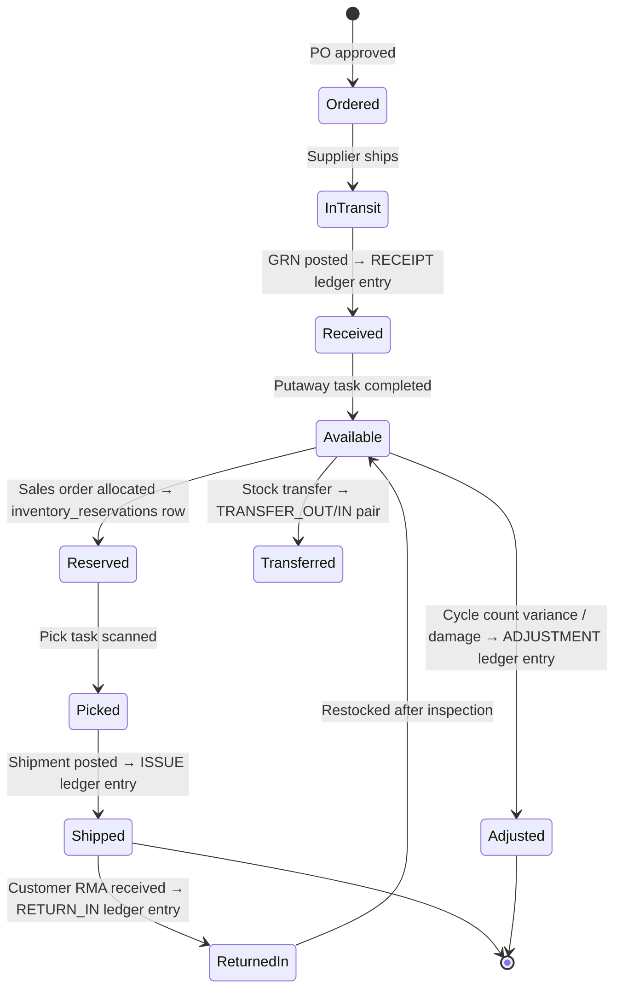

---

## 8. Double-Entry Accounting & GL Posting Flows

### 8.1 Core Principle: Every Financial Event Is a Balanced Journal

Mirroring the inventory ledger, the General Ledger is **append-only and self-balancing**:
every `gl_journal_headers` row owns a set of `gl_journal_lines`, and the database enforces
`Σ debit_amount = Σ credit_amount` for that set via a `CHECK`/trigger before the journal
can transition from `DRAFT` to `POSTED`. No sub-ledger (AP, AR, Inventory, Tax, Payroll)
ever writes directly to `gl_account_balances`; every sub-ledger transaction generates a
journal, and `gl_account_balances` is a derived rollup — exactly the same
ledger-then-derive pattern as inventory (§7.1).

### 8.2 Posting Rules: Configurable Event → Account Mapping

Rather than hard-coding "an AR invoice debits Accounts Receivable and credits Revenue,"
the mapping is **data-driven** via `gl_posting_rules`: a table of
`(event_code, debit_account_id, credit_account_id, condition_expr)` rows that the
posting engine evaluates when a triggering event occurs. This lets each tenant configure
their own Chart of Accounts mapping (e.g., separate revenue accounts per item category,
or separate COGS accounts per warehouse) without code changes.

| Event Code | Typical Debit | Typical Credit | Triggered By |
|---|---|---|---|
| `GRN_POSTED` | Inventory (Asset) | GR/IR Clearing | Goods Receipt Note posted |
| `AP_INVOICE_MATCHED` | GR/IR Clearing + Input Tax | Accounts Payable | 3-way match completed |
| `AP_PAYMENT_ISSUED` | Accounts Payable | Bank / Cash | AP payment cleared |
| `AR_INVOICE_ISSUED` | Accounts Receivable | Revenue + Output Tax Payable | AR invoice issued |
| `COGS_ON_SHIPMENT` | Cost of Goods Sold | Inventory (Asset) | Shipment posted (uses valuation-layer cost, §7.5) |
| `AR_RECEIPT_CLEARED` | Bank / Cash | Accounts Receivable | Customer receipt cleared |
| `INVENTORY_ADJUSTMENT_POSITIVE` | Inventory (Asset) | Inventory Gain/Loss | Stock adjustment (found stock) approved |
| `INVENTORY_ADJUSTMENT_NEGATIVE` | Inventory Gain/Loss | Inventory (Asset) | Stock adjustment (write-off) approved |
| `TAX_COLLECTED` | (component of AR invoice journal) | Output Tax Payable (per `tax_rates.gl_account_id`) | Tax transaction computed |
| `TAX_PAID` | Input Tax Credit | (component of AP invoice journal) | Tax transaction computed on purchase |

### 8.3 End-to-End Posting Flow — Procure-to-Pay Example

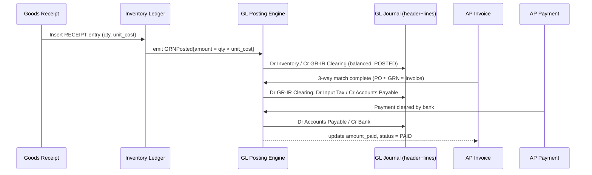

### 8.4 End-of-Period Close & Balance Rollup

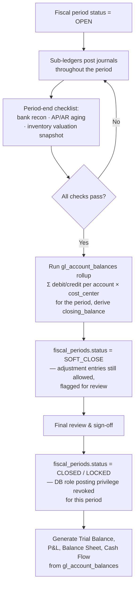

A **locked period** is enforced at two levels: (1) the application blocks journal-date
selection within locked periods, and (2) a database constraint/trigger on
`gl_journal_headers` checks `fiscal_periods.status NOT IN ('CLOSED','LOCKED')` before
allowing an insert with that `fiscal_period_id` — defense in depth against both
application bugs and direct data manipulation.

### 8.5 Reversals, Not Edits — Same Discipline as the Inventory Ledger

Posted journals are never updated. A correction creates a new journal with debits and
credits *swapped* relative to the original, linked via `reverses_journal_id`, dated
either in the original period (if still open) or the current period (if the original is
closed) — standard "reversing entry" accounting practice, made structurally explicit in
the schema rather than left to operator discipline.

### 8.6 Sub-Ledger to General Ledger Reconciliation

Because every sub-ledger document carries a `gl_journal_id` foreign key (see
`ap_invoices.gl_journal_id`, `ar_invoices.gl_journal_id`, `ap_payments.gl_journal_id`,
etc.), and every inventory-driven journal references its originating
`inventory_ledger`/`inventory_valuation_layers` rows, **the AP/AR sub-ledgers and the
inventory ledger reconcile to the GL by construction** — there is no batch
"reconciliation run" trying to match independently-maintained totals after the fact.
A mismatch can only arise from a bug, and the same nightly consistency job described in
§7.3 cross-checks `Σ open AP invoices = AP control account balance` and
`Σ open AR invoices = AR control account balance`, logging any drift to `audit_logs` for
investigation.

---

## 9. Warehouse & Barcode Architecture

### 9.1 Storage Topology

The warehouse model is a strict hierarchy that mirrors the physical floor, giving every
storage point an addressable, scannable identity:

```
Warehouse (DC-MUMBAI-01)
 └─ Zone (RECEIVING / BULK_STORAGE / PICK_FACE / STAGING / RETURNS / QUARANTINE)
     └─ Aisle (A, B, C, ...)
         └─ Rack (01, 02, ...)
             └─ Bin  (barcode: "MUM01-A-01-03-B")  ← smallest addressable location
                 └─ License Plate (LP barcode, e.g. pallet "LP-0048213")
                     └─ Items (batch/serial, quantity)
```

- **`warehouse_bins.barcode`** is the printed/scanned label on physical shelving —
  every put, pick, move, and count operation resolves to a `bin_id` via a barcode scan,
  never free-text entry.
- **License plates (`license_plates`)** group items for movement as a single scannable
  unit (a pallet, case, or tote). Scanning one LP barcode can move dozens of SKUs/lines
  in one ledger-generating action — essential for receiving and cross-docking
  throughput. LPs can nest (`parent_lp_id`) for case-on-pallet hierarchies.
- **`bin_type` and `is_pickable`** drive system behavior: `putaway_rules` route received
  goods toward `BULK_STORAGE`; replenishment tasks move stock from bulk to `PICK_FACE`;
  `QUARANTINE` bins are excluded from ATP (`inventory_balances` for quarantined batches
  do not contribute to `quantity_available`).

### 9.2 Barcode / Scan-Driven Workflow

Every physical movement is **directed and confirmed by a scan**, which is what makes the
inventory ledger trustworthy at the source — data quality is enforced at the point of
physical action, not reconciled after the fact.

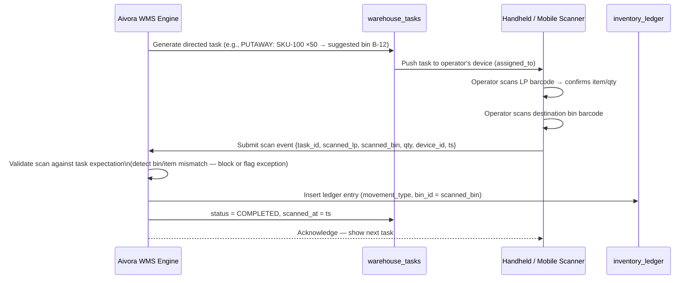

Key design choices:

- **Suggested vs. scanned location reconciliation**: the system *suggests* a bin
  (`to_bin_id`), but the ledger entry always records the *scanned* bin — physical
  reality wins, and a mismatch is logged as an exception event for supervisor review
  (and as a training signal for the putaway-recommendation model, §15).
- **Symbology support**: Code-128 / GS1-128 (cartons, pallets — supports embedded
  batch/expiry/serial via AI prefixes), QR (bins, license plates, item labels), and
  EPC/RFID (high-velocity dock and yard scanning) are all normalized into the same
  `device scan event` shape before hitting the domain service — the ledger doesn't care
  which physical technology produced the identifier.
- **Offline-first mobile**: `warehouse_tasks.device_id` plus a client-generated UUID
  (assigned at scan time, not at sync time) lets handhelds queue scan events locally
  during connectivity loss and sync idempotently — duplicate submissions of the same
  client UUID are detected and ignored server-side, preventing double-posted ledger
  entries.

### 9.3 Pick, Pack & Replenishment Optimization

- **Wave/batch picking**: `pick_lists` group multiple `sales_order_lines` (or transfer
  lines) that share a route/zone/carrier cutoff into a single `pick_list`, whose
  `pick_list_lines` are sequenced by **pick-path optimization** (serpentine traversal of
  aisle/rack/bin coordinates) to minimize travel distance — the sequencing algorithm
  consumes the same `warehouse_bins` topology used for storage.
- **Task interleaving**: `warehouse_tasks` of different types (`PUTAWAY`, `PICK`,
  `REPLENISH`) can be interleaved on one route to avoid empty-handed travel — an
  operator putting away receipts can be routed past pick-face bins that need
  replenishment.
- **Replenishment triggers**: when `inventory_balances.quantity_available` for a
  `PICK_FACE` bin drops below a configured threshold, the system auto-generates a
  `REPLENISH` task moving stock from `BULK_STORAGE`.

### 9.4 Cycle Counting

`cycle_counts` / `cycle_count_lines` capture **blind counts** (operators do not see the
system-expected quantity while counting, to avoid confirmation bias). Variances between
`counted_quantity` and the system's `inventory_balances` snapshot at count time generate
`stock_adjustments` (subject to approval thresholds — large variances route through
`approval_requests`), which in turn post `ADJUSTMENT_POSITIVE`/`ADJUSTMENT_NEGATIVE`
ledger entries and corresponding GL journals (§8.2).

---

## 10. Batch / Serial Number Traceability

### 10.1 Why Both Models Exist

| | Batch/Lot Tracking | Serial Number Tracking |
|---|---|---|
| Granularity | A produced/received *lot* of N units sharing attributes (mfg date, expiry, supplier lot) | Each individual unit has a unique, persistent identity |
| Typical use | Food, pharma, chemicals, raw materials — anything with expiry/recall requirements | Electronics, equipment, high-value assets, warranty-tracked goods |
| Ledger linkage | `inventory_ledger.batch_id → inventory_batches` | `inventory_ledger.serial_id → inventory_serials` |
| Quantity per ledger row | Can be > 1 (whole batch quantities move together) | Always 1 (a serial is indivisible) |
| Lifecycle table | `inventory_batches` — batch is the unit of quarantine/recall | `inventory_serials` — serial carries its own current-location/status (no separate balance projection needed; the serial *is* the balance) |

`items.is_batch_tracked` / `items.is_serial_tracked` are mutually exclusive flags that
gate which path the receiving and shipping workflows take for that item — the schema
supports both because real catalogs mix tracked and untracked items freely.

### 10.2 Batch Lifecycle & Genealogy

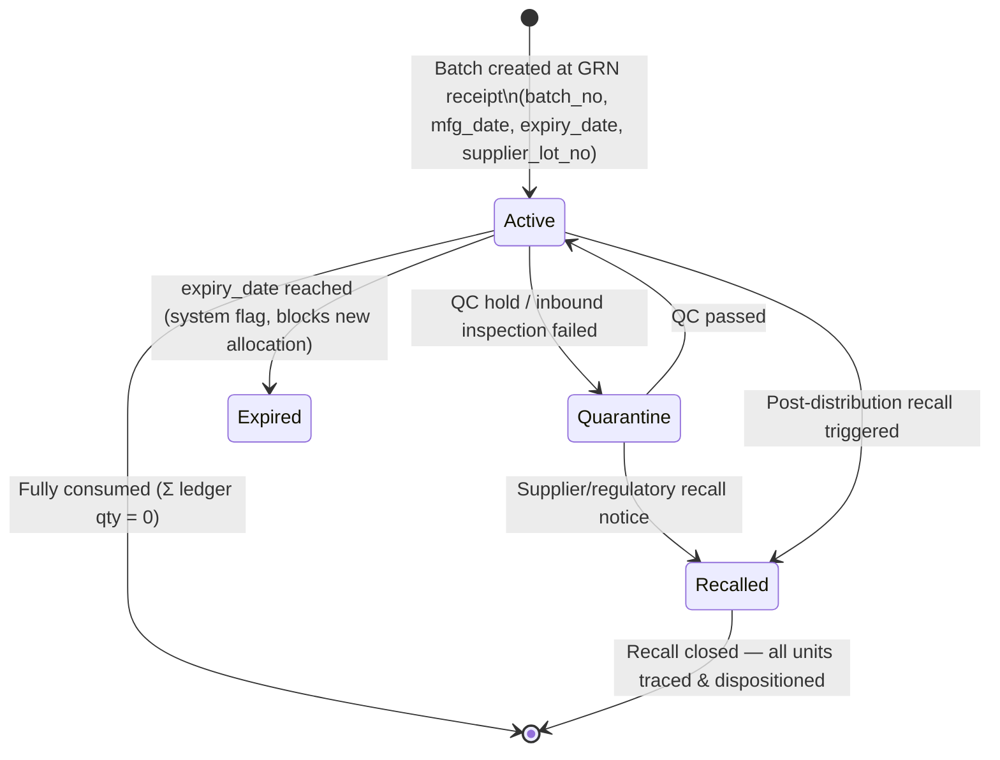

- **FEFO (First-Expired-First-Out) allocation**: when `inventory_reservations` are
  created for a batch-tracked item, the allocation engine prefers the open batch with
  the earliest `expiry_date` among eligible (non-quarantined, non-expired) batches at
  the fulfilling warehouse — configurable per item to fall back to FIFO by receipt date.
- **Genealogy / where-used**: because every `inventory_ledger` row carrying a `batch_id`
  is permanently linked to its `source_document_type/id` (GRN line on receipt, shipment
  line on issue, transfer on movement), a single query against the ledger answers both
  **"where did this batch go?"** (forward trace, for recalls — every customer/shipment
  that received units from batch X) and **"where did the materials in this shipment come
  from?"** (backward trace — every supplier lot that contributed to a customer's order).
  This is the immutable-ledger design paying for itself directly in regulatory/recall
  scenarios.

### 10.3 Serial Number Lifecycle

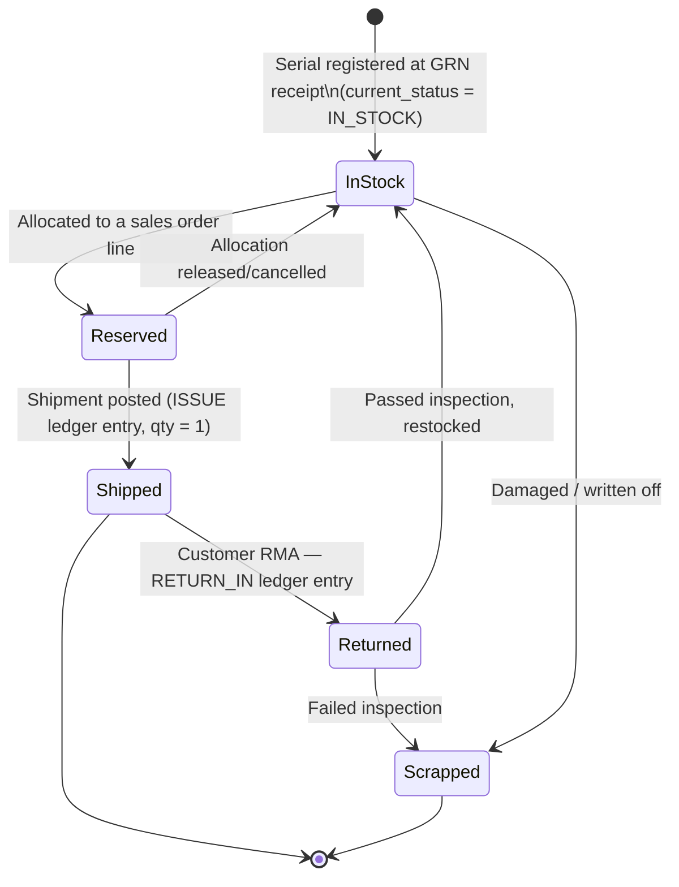

`inventory_serials.current_status`, `current_warehouse_id`, and `current_bin_id` are
**denormalized current-state fields maintained by the same ledger-projection mechanism**
as `inventory_balances` (§7.3) — every ledger row referencing a `serial_id` updates these
fields transactionally, and they can likewise be rebuilt by replaying the ledger filtered
to that `serial_id`. This gives instant "where is unit X right now / what is its full
history" lookups (critical for warranty service, theft investigation, and high-value
asset audits) without scanning the full ledger at read time.

### 10.4 Cross-Cutting Traceability Query Pattern

Both models converge on the same query shape against `inventory_ledger`, which is why
the ledger schema treats `batch_id` and `serial_id` as peer optional columns rather than
splitting into separate ledger tables:

```sql
-- "Full chain of custody for everything that touched batch B-2026-0091"
SELECT entry_no, movement_type, quantity, warehouse_id, bin_id,
       source_document_type, source_document_id, occurred_at
FROM inventory_ledger
WHERE batch_id = :batch_id
ORDER BY entry_no;
```

The same shape — substituting `serial_id = :serial_id` — produces a unit's complete
lifecycle history, and joining `source_document_type/id` back to `goods_receipt_notes`,
`shipments`, `sales_orders`, and ultimately `customers`/`suppliers` produces the full
genealogy report demanded by recall and compliance workflows.

---

## 11. GST / Tax Architecture

### 11.1 Design Goal: One Engine, Many Regimes

The platform targets India GST as the primary/reference regime (reflected in the v1.0
module list) while remaining structurally able to support VAT/sales-tax regimes in other
geographies — achieved by never hard-coding tax logic into transactional code. All tax
behavior is **data-driven** through `tax_codes` → `tax_rates` (versioned, multi-component)
plus `place_of_supply_rules` and `tax_jurisdictions`.

```
tax_codes (e.g. "GST18")
  └─ tax_rates (versioned components, each with its own GL account)
       ├─ CGST   9%   effective_from 2026-01-01   → gl_account "Output CGST Payable"
       ├─ SGST   9%   effective_from 2026-01-01   → gl_account "Output SGST Payable"
       └─ IGST  18%   effective_from 2026-01-01   → gl_account "Output IGST Payable"
```

A single `tax_code` can therefore represent a **compound, multi-component** tax
(`is_compound`), and each component posts to its own GL account — which is what makes
statutory reports (which must show CGST/SGST/IGST separately) and the GL trial balance
(which must show the same split) derive from the *same* underlying `tax_transactions`
rows rather than two independently-maintained representations.

### 11.2 Tax Determination Flow

```mermaid
flowchart TD
    A[Transaction line created\ne.g. Sales Order Line] --> B{Determine HSN/SAC\nfrom items.hsn_sac_code}
    B --> C{Determine place of supply\nship-from state vs ship-to state\nvia place_of_supply_rules}
    C -->|Same state| D[Intra-state: apply\nCGST + SGST components]
    C -->|Different state| E[Inter-state: apply\nIGST component]
    D --> F[Resolve applicable tax_code\nfor item category × jurisdiction\nas of transaction date — tax_rates.effective_from]
    E --> F
    F --> G[Compute taxable_amount × rate\nfor each component]
    G --> H[Insert tax_transactions rows\n— one per component, append-only]
    H --> I[Tax amounts feed into\ndocument totals AND\nGL posting (§8.2 TAX_COLLECTED/TAX_PAID)]
```

Because `tax_rates` is **versioned by `effective_from`/`effective_to`**, a rate change
(which happens routinely with GST notifications) never mutates historical transactions —
each `tax_transactions` row freezes the `tax_rate_percent` that applied on that
document's date, so previously issued invoices remain correct under audit even after
the configured rate changes going forward.

### 11.3 E-Invoicing & E-Way Bill Compliance

| Table | Role |
|---|---|
| `e_invoices` | Stores the Invoice Reference Number (IRN), QR code payload, and acknowledgment returned by the government Invoice Registration Portal (IRP) for each qualifying `ar_invoices` row |
| `e_way_bills` | Stores e-way bill numbers and validity windows for shipments crossing the statutory value/distance thresholds, linked to `shipments` |
| `gst_returns` | Stores periodic return-filing batches (e.g., GSTR-1 outward-supply statements, GSTR-3B summary returns) aggregated from `tax_transactions` for the filing period |

The flow for an outbound invoice:

1. `ar_invoices` is finalized (`status = 'ISSUED'`) with its `tax_transactions` lines
   computed.
2. An async integration job submits the invoice payload to the IRP/government API.
3. On success, the returned IRN + QR are persisted to `e_invoices` and linked back via
   `ar_invoices.e_invoice_id`; the invoice PDF is regenerated to include the QR code.
4. If the shipment value/distance crosses the e-way-bill threshold, a corresponding
   `e_way_bills` record is generated and linked to the `shipments` row before dispatch
   is allowed to proceed (a hard gate enforced in the shipment workflow).
5. Failures are retried with exponential backoff and surfaced to Compliance Officers via
   `notifications`; nothing blocks the underlying commercial transaction — compliance
   submission is decoupled from order fulfillment, but **dispatch** is gated on e-way
   bill issuance where legally required.

### 11.4 Statutory Return Generation

`gst_returns` rows are generated by aggregating `tax_transactions` (joined to their
source documents) for a filing period, grouped by component, HSN/SAC code, and
counterparty GSTIN — i.e., the exact shape GSTR-1/GSTR-3B-equivalent filings require.
Because `tax_transactions` is itself an append-only, document-linked ledger (mirroring
the inventory and GL ledgers), the generated return is **always reproducible and
reconcilable** back to the individual invoices that produced it — eliminating the
"spreadsheet reconciliation before filing" pain point common in legacy ERPs.

### 11.5 Input Tax Credit (ITC) Matching

On the procurement side, `tax_transactions` rows with `tax_component` representing input
tax (e.g., Input CGST/SGST/IGST on a vendor invoice) feed an **ITC matching** process
that reconciles the tenant's claimed input credit against the supplier's reported
outward-supply data (typically ingested via GSTN APIs as a future integration, §15) —
mismatches are surfaced as `ai_recommendations`-style exception items for the Accounts
Payable team to resolve before claiming credit, reducing audit risk.

### 11.6 Internationalization Beyond GST

For tenants operating in VAT/sales-tax jurisdictions, the same tables apply with
different configuration: `tax_codes.tax_type = 'VAT'` or `'SALES_TAX'`, single-component
`tax_rates` rows (no CGST/SGST split), and `place_of_supply_rules` reduced to a simple
jurisdiction lookup. `e_invoices`/`e_way_bills`/`gst_returns` simply remain unused for
such tenants — no schema branching required, only configuration.

---

## 12. RBAC Security Model

### 12.1 Architecture Decision: Why a Hybrid RBAC + ABAC + SoD Model

An ERP/SCM platform's authorization model is not a generic "who can click this button"
concern — it is the **primary structural control against financial fraud and inventory
shrinkage**. The single most common failure mode in mid-market ERP deployments is not a
broken permission check; it is a *correctly enforced* permission model that nonetheless
lets one person create a vendor, raise a purchase order, approve it, receive the goods,
approve the invoice, and release the payment — end to end, alone. Any RBAC design for
Aivora has to be judged primarily on whether it can prevent, detect, and prove the
absence of exactly that scenario, not merely on whether it can hide a menu item.

Three well-known authorization paradigms were evaluated against this bar:

| Dimension | Pure RBAC | Pure ABAC | ReBAC (Zanzibar-style graph) | **Hybrid (chosen)** |
|---|---|---|---|---|
| "Who can approve POs over ₹50,000?" — answerable by an auditor in one query | ✅ enumerable role → permission join | ❌ requires simulating policy code against every attribute combination | ⚠️ requires a graph traversal across relation tuples | ✅ enumerable role/permission join, with the *condition* visible inline as data (`condition_expr`) |
| Expresses dynamic, value-based conditions (amount thresholds, item categories, time windows) | ❌ forces **role explosion** — "PO Approver ≤50K," "PO Approver ≤2L," "PO Approver — Electronics only," … combinatorially | ✅ native — this is ABAC's whole reason to exist | ⚠️ awkward; relations aren't naturally value-bearing | ✅ native, via a small JSONB **overlay** on top of role grants — no new paradigm to learn |
| Models the org hierarchy (tenant → company → branch → warehouse) that drives 90% of Aivora's scoping needs | ✅ a natural fit — this *is* what scoped role assignment does | ⚠️ requires hierarchy-walking policy logic for every check | ✅ natural fit, but at the cost of standing up dedicated graph infrastructure | ✅ natural fit — reuses the same scoped-assignment mechanism RBAC already provides |
| First-class **fraud / Segregation-of-Duties** modeling | ❌ not a concept in the model at all | ❌ not a concept in the model at all | ❌ not a concept in the model at all | ✅ purpose-built engine (§12.6) — this is the deciding factor for an ERP |
| Operational cost (build, test, explain to auditors, onboard new admins) | Low | High — policies are code; testing them is a software project in itself | Very high — requires a dedicated relationship-graph service and a new mental model | Moderate — one familiar role model, two narrowly-scoped overlays |
| Precedent in mature ERPs | Partial (most ERPs *start* here and outgrow it) | Rare as the primary model | Not used by ERP vendors | **This is what SAP (authorization objects + field values), Oracle Fusion (role-based + data security policies), and Microsoft Dynamics 365 (duties/privileges + business-event rules) all converge on** — independently arriving at the same hybrid shape |

**Decision: Aivora adopts Role-Based Access Control as the structural backbone**
— because it is auditable, matches the org hierarchy, and is the model every ERP
administrator already understands — **and layers two narrow, targeted overlays on
top of it**:

1. An **ABAC overlay** (`role_permissions.condition_expr`, §12.5) so a single role
   can carry value-based conditions ("approve POs up to ₹50,000," "only for
   Electronics," "only outside business hours requires dual sign-off") *without*
   spawning a new role for every threshold combination.
2. A **Segregation-of-Duties engine** (`sod_conflict_rules` / `sod_violations`,
   §12.6) that makes "no one person can both create and approve a payment" a
   **declared, machine-checked invariant** rather than a hope embedded in training
   material.

A pure-ABAC or pure-ReBAC rebuild was rejected specifically because it would trade
a problem Aivora *can* solve cleanly (role explosion, via a small JSONB column) for
a problem it would then have to solve from scratch (auditability, fraud modeling)
that the hybrid gets "for free" from RBAC's structure. **Time-boxed delegation**
(§12.7) is added as a fifth, orthogonal layer because temporary role transfer
("I'm on leave, route my approvals to Priya for two weeks") is an operational
reality that, left unmanaged, is exactly how SoD violations and orphaned access
actually happen in practice.

### 12.2 The Layered Authorization Architecture

Each layer below answers a different question, owns a different table (or column),
and can be reasoned about — and audited — independently. A request is authorized
only when it survives all five in sequence:

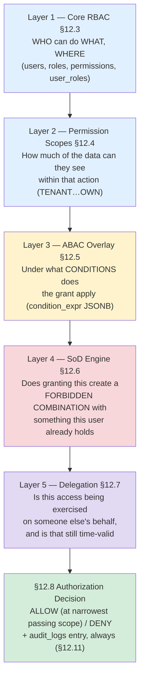

| Layer | Mechanism | Owning schema | Solves |
|---|---|---|---|
| 1. Core RBAC | Named roles bundle atomic permissions; assignments are scoped to company/branch/warehouse | `roles`, `permissions`, `role_permissions`, `user_roles` | "Can this *kind* of user do this *kind* of action, in this *part* of the org?" — the 90% case, fully auditable as static data |
| 2. Permission Scopes | A `scope` enum on each grant narrows data visibility independent of where the role is assigned | `role_permissions.scope` | "…and how much of the data can they see while doing it?" |
| 3. ABAC Overlay | A `condition_expr` JSONB column attaches dynamic, value-based predicates to an *individual* grant | `role_permissions.condition_expr` | "…but only when the amount/category/time/requester satisfies X" — without multiplying roles |
| 4. SoD Engine | Declared forbidden permission/role pairs are checked at assignment time (preventive) and by periodic scan (detective) | `sod_conflict_rules`, `sod_violations` | "…and does giving them this, combined with what they already have, create a fraud opportunity?" |
| 5. Delegation | Time-boxed, approved transfer of a role's authority from one user to another | `role_delegations` | "…or are they exercising someone *else's* authority, and is that grant still within its valid window?" |

### 12.3 Layer 1 — Core RBAC: Roles, Permissions, and Scoped Assignment

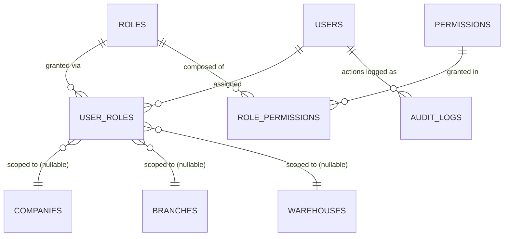

- **Permissions are atomic and machine-checkable**: `permissions.code` follows a
  `module.entity.action` convention (e.g., `procurement.purchase_order.approve`,
  `inventory.stock_adjustment.create`, `finance.fiscal_period.close`). The API gateway
  resolves the required permission code for every endpoint and checks it against the
  caller's effective permission set — there is no endpoint that is reachable without an
  explicit permission grant ("deny by default").
- **Roles are named bundles of permissions** (`role_permissions`), allowing
  administrators to think in terms of job functions ("Warehouse Operator," "AP Clerk,"
  "Controller") rather than memorizing permission codes. Both **system roles**
  (platform-defined, non-editable, ship with sensible defaults) and **custom roles**
  (tenant-defined) are supported via `roles.is_system_role`.
- **Assignments are scoped** (`user_roles.company_id` / `branch_id` / `warehouse_id`,
  each nullable meaning "all"): a user can be a Warehouse Operator *only* for
  `DC-MUMBAI-01`, and simultaneously an AP Clerk for the whole company — multiple
  scoped role assignments compose into the user's effective permission set.
- **Roles stay coarse on purpose.** The temptation in every RBAC rollout is to mint a
  new role the moment a single exception appears ("PO Approver but only for IT
  purchases"). Aivora deliberately pushes that kind of nuance down into Layer 3
  (§12.5) so the role catalog stays small enough that a human — and an auditor — can
  read the whole thing in one sitting.

### 12.4 Layer 2 — Permission Scopes

`role_permissions.scope` adds a second dimension beyond the assignment scope —
**data visibility within an action**:

| Scope | Meaning | Example |
|---|---|---|
| `TENANT` | Action applies across the entire tenant | Platform Admin managing tenant settings |
| `COMPANY` | Action applies within one legal entity | Controller closing books for Company A only |
| `BRANCH` | Action applies within one business unit | Branch manager approving local POs |
| `WAREHOUSE` | Action applies within one warehouse | Warehouse Operator scanning only at DC-MUMBAI-01 |
| `OWN` | Action applies only to records the user created/owns | Sales rep viewing only their own quotations |

The **effective permission** for a request is the narrowest applicable scope granted —
evaluated server-side, never trusted from the client.

### 12.5 Layer 3 — Attribute-Based Conditional Grants (the ABAC Overlay)

This is where Aivora deliberately departs from textbook RBAC, and it is the single
change that prevents the role catalog from exploding. Rather than encoding "approve
purchase orders up to ₹50,000" as a *role*, the threshold is encoded as **data**
attached to the grant:

```
role_permissions row:
  role_id        → "Branch Manager"
  permission_id  → procurement.purchase_order.approve
  scope          → BRANCH
  condition_expr → {
                      "max_amount": 50000,
                      "currency": "INR",
                      "exclude_if_requested_by_self": true
                    }
```

A **Controller** can hold the *same* permission, at `COMPANY` scope, with
`condition_expr: null` (unconditional — the textbook "escalation" case), and a
**Regional Head** can hold it with `{"max_amount": 500000}`. Three roles, one
permission code, zero duplicated authorization logic — the approval ladder is
expressed entirely as rows of data that a non-engineer admin can review and edit.

**Supported condition predicates** (evaluated server-side against live request
context — never trusted from the client):

| Key | Evaluated against | Example use |
|---|---|---|
| `max_amount` / `min_amount` | The transaction's monetary value | Tiered approval ladders (₹50K → ₹2L → ₹10L → unlimited) |
| `item_categories` | `items.category_id` of the lines on the document | "Can approve stock write-offs, but only for the Perishables category" |
| `time_window` | Server time at the moment of the request | "Out-of-hours GL postings require the Controller role, not just the AP Clerk" |
| `exclude_if_requested_by_self` | Whether `requested_by = current_user` | The single most important predicate in the system — see §12.6, SOD-01 |
| `warehouse_categories` / `branch_tags` | Tags on the scoping entity | "Only for warehouses tagged `bonded` " (customs-bonded stock) |

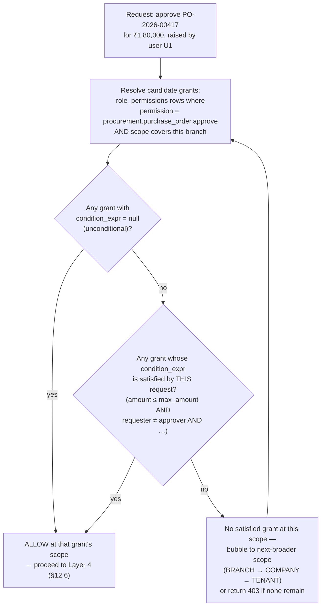

Because every `condition_expr` is **stored as plain JSONB and rendered in the admin
UI as a readable rule** ("≤ ₹50,000, cannot approve own requests"), the auditability
advantage of RBAC is preserved — an auditor still runs one query to see "everyone who
can approve POs, and exactly under what conditions" — while gaining ABAC's expressive
power exactly where the ERP domain actually needs it: money thresholds and
self-approval exclusion. This is the same pattern Aivora already uses for
`gl_posting_rules.condition_expr` (§8.2) — one mechanism, reused, rather than a
second bespoke policy engine.

### 12.6 Layer 4 — Segregation of Duties (SoD) Engine

If Layer 3 is what makes the model *expressive enough*, Layer 4 is what makes it
**trustworthy enough for an ERP** — and it is the layer that has no equivalent in a
textbook RBAC/ABAC/ReBAC comparison, because general-purpose authorization theory
doesn't have a concept of "fraud." Finance and audit teams don't ask "can user X do
Y?" — they ask **"can any single person do Y *and* Z, and if so, why haven't we
stopped that?"** Aivora answers that question as a first-class, queryable, *enforced*
artifact rather than a policy document nobody re-reads after go-live.

**Schema** (full DDL in §5.3):

- **`sod_conflict_rules`** — the declared conflict matrix: pairs of permission codes
  (or role names) that must never both be held by the same user at an overlapping
  scope, each with a `severity` (`HIGH` / `MEDIUM` / `LOW`) and a human-readable
  `description` an auditor can cite directly in a finding.
- **`sod_violations`** — every detected conflict, with `status`
  (`OPEN` → `WAIVED` *with a documented compensating control* → `REMEDIATED`),
  `resolved_by`, and `resolution_notes`. This table is the audit trail's audit trail:
  it proves not just that conflicts are *detected*, but that every one of them was
  *seen by a human and explicitly dispositioned*.

**Representative conflict matrix** (ships as system-defined rows; tenants may add
their own):

| Rule | Conflicting permissions / roles | Why it's dangerous | Severity |
|---|---|---|---|
| `SOD-01` | `procurement.purchase_order.create` **+** `procurement.purchase_order.approve` (same user) | Classic self-approval — raise a PO to a shell vendor and approve your own spend | HIGH |
| `SOD-02` | `procurement.supplier.create_or_edit` **+** `procurement.purchase_order.approve` | Create a fictitious vendor, then approve POs to it — the #1 procurement fraud pattern | HIGH |
| `SOD-03` | `inventory.grn.approve` **+** `finance.ap_invoice.approve` | Collusion to confirm receipt of goods that were never delivered, then pay for them | HIGH |
| `SOD-04` | `finance.ap_invoice.create` **+** `finance.payment.approve` | Invoice the company, then approve your own payment run | HIGH |
| `SOD-05` | `finance.payment.create` **+** `finance.payment.approve` | Violates the maker-checker principle that is non-negotiable for any cash movement | HIGH |
| `SOD-06` | `sales.credit_limit.override` **+** `sales.sales_order.approve` | Wave through an order to a customer already over their approved credit exposure | MEDIUM |
| `SOD-07` | `inventory.write_off.create` **+** `inventory.write_off.approve` | Self-approve inventory write-offs — the standard mechanism for concealing shrinkage/theft | HIGH |
| `SOD-08` | `finance.gl_journal.create_manual` **+** `finance.gl_journal.post` (without a third-party reviewer) | Manual journal entries bypass the system-generated posting rules (§8.2) — the highest-risk GL surface, must always be maker-checker | HIGH |
| `SOD-09` | `security.role.assign` **+** *holds any HIGH-severity permission above* | Privilege self-escalation — granting yourself (or a confederate) the very access this matrix exists to constrain | HIGH |
| `SOD-10` | `finance.bank_reconciliation.perform` **+** `finance.bank_statement.upload` | Upload a doctored statement, then "reconcile" against it — classic concealment of skimmed cash | MEDIUM |

**Enforcement is two-layered, matching how real audits work:**

```mermaid
sequenceDiagram
    participant A as Admin
    participant GW as API Gateway
    participant SOD as SoD Engine
    participant DB as PostgreSQL

    Note over A,DB: PREVENTIVE — checked at the moment of assignment
    A->>GW: Assign role "AP Clerk" to user U1
    GW->>SOD: Would this grant + U1's existing\neffective permissions violate any sod_conflict_rules?
    SOD->>DB: Query user_roles ⋈ role_permissions for U1,\ncompare codes against sod_conflict_rules
    alt Conflict found
        SOD-->>GW: BLOCK — return matching rule + plain-language reason
        GW-->>A: 409 Conflict: "U1 already holds finance.ap_invoice.create;\nthis assignment would violate SOD-04"
        Note over A: Admin must either choose a different user,\nor route through a documented exception/waiver workflow
    else No conflict
        SOD-->>GW: OK
        GW->>DB: INSERT user_roles row
    end

    Note over A,DB: DETECTIVE — periodic sweep catches drift\n(roles edited after assignment, bulk imports, legacy data)
    loop Nightly batch (and on every role/permission edit)
        SOD->>DB: Scan all users' effective permission sets\nagainst sod_conflict_rules
        SOD->>DB: INSERT sod_violations for every new match\n(status = OPEN, severity from the rule)
    end
    SOD-->>A: Surface OPEN violations on the\nCompliance dashboard for disposition
```

The preventive check stops the *easy* 90% of violations — the moment someone tries
to assign a conflicting role. The detective sweep exists because real systems drift:
permissions get added to an existing role months later, bulk CSV imports bypass the
UI, or a tenant migrates legacy data with pre-existing conflicts. **Every `OPEN`
violation must be explicitly `WAIVED` (with a named compensating control — e.g., "Both
actions additionally require the Regional Controller's co-sign, logged in
`audit_logs`") or `REMEDIATED`** — an unresolved HIGH-severity violation is surfaced
on the Controller's and the tenant admin's dashboards and cannot be silently dismissed.
This converts "we have a segregation-of-duties policy" from a sentence in an onboarding
deck into a number — *open HIGH violations: 0* — that a SOX or ISO 27001 auditor can
verify by querying the database directly.

### 12.7 Layer 5 — Delegation & Temporal Access

Every SoD model eventually meets its real-world adversary: **vacation**. A Branch
Manager who is the sole holder of `procurement.purchase_order.approve` for
`DC-PUNE-02` goes on two weeks' leave, and the business cannot simply stop approving
purchase orders. The undocumented, un-audited workaround — "just give Rohan my
password until I'm back" — is precisely how SoD violations and orphaned access
actually enter real systems. Aivora makes the *legitimate* version of this
first-class, time-boxed, and fully audited via `role_delegations` (full DDL in §5.3:
`delegator_user_id`, `delegate_user_id`, `role_id`, optional
`scope_company_id`/`scope_warehouse_id`, `valid_from`, `valid_until`, `status`,
`approved_by`, `reason`).

```mermaid
stateDiagram-v2
    [*] --> Requested: Delegator (or their manager)\nrequests transfer of role R\nto delegate, for [valid_from, valid_until]
    Requested --> PendingApproval: Role R carries any\nsensitive/HIGH-severity permission\n(approval required — see below)
    Requested --> Active: Role R is low-risk —\nauto-activates at valid_from
    PendingApproval --> Active: Approver signs off\n(approved_by populated;\nSoD check re-run for the DELEGATE — §12.6)
    PendingApproval --> Rejected: Approver declines\n(e.g., delegate already holds a conflicting permission)
    Active --> Expired: System clock crosses valid_until —\nautomatic, no manual step required
    Active --> Revoked: Delegator returns early,\nor admin force-revokes
    Expired --> [*]
    Revoked --> [*]
    Rejected --> [*]
```

Three properties make this safe rather than merely convenient:

- **The SoD engine runs again, against the *delegate*.** Transferring
  `finance.payment.approve` to someone who already holds
  `finance.payment.create` would recreate `SOD-05` in a different person — the
  same preventive check from §12.6 fires at delegation-approval time, not just at
  direct role assignment.
- **Expiry is structural, not procedural.** `valid_until` is enforced in the
  effective-permission resolution query itself (`WHERE status = 'ACTIVE' AND now()
  BETWEEN valid_from AND valid_until`) — there is no "remember to revoke this on
  Friday" step for an admin to forget. A delegation that nobody remembered to close
  out simply stops working the moment its window ends.
- **Every action taken under delegation is doubly attributed.** `audit_logs`
  records both `actor_user_id` (the delegate, who physically clicked approve) and
  `acting_as_delegation_id` (linking back to the `role_delegations` row), so a
  post-incident review can answer both "who actually did this?" and "under whose
  authority were they acting, and was that authority valid at the time?" in a
  single query.

### 12.8 End-to-End Authorization Decision Flow

Putting all five layers together, here is what happens, in order, for a single
incoming request — e.g., `POST /procurement/purchase-orders/{id}/approve`:

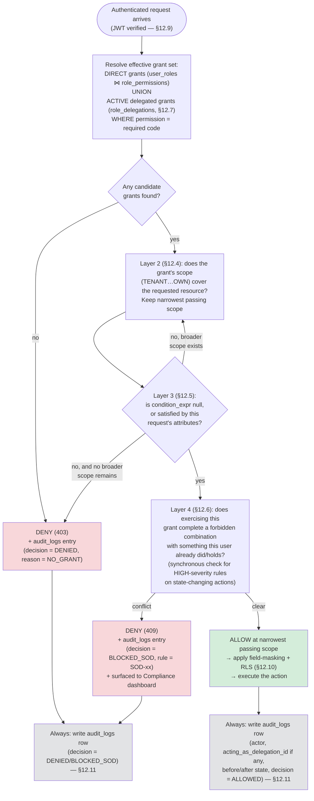

Two design choices are deliberate and worth calling out:

- **Every branch — allowed, denied, or blocked — writes to `audit_logs`.** A
  *denied* attempt to approve one's own purchase order is, from a fraud-detection
  standpoint, at least as interesting as a successful one. Logging only successes
  (the common shortcut) would blind the anomaly-detection service (§15.4 / §12.11)
  to exactly the probing behavior it most needs to see.
- **The SoD check (Layer 4) runs *after* the grant is otherwise confirmed valid**,
  not before. This ordering means a user without the underlying permission gets a
  clean, generic `403` (revealing nothing about the conflict matrix to an
  unauthorized caller), while a user who *does* have the permission but would
  complete a forbidden combination gets a specific, auditable `409` — the
  distinction itself is a small but real piece of defense-in-depth.

### 12.9 Authentication & Session Flow

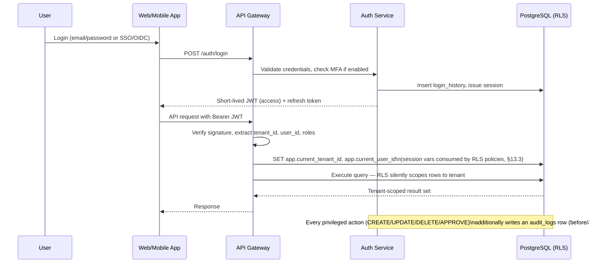

- **JWT claims** carry `tenant_id`, `user_id`, and a compact role-reference (not the
  full permission set, which can change between token refreshes — and now can also
  change mid-session via delegation activation/expiry, §12.7) — the gateway
  re-resolves effective permissions from `user_roles`/`role_permissions`/
  `role_delegations` on each request (cached with a short TTL) so that role changes
  (e.g., immediate suspension, a delegation expiring at midnight) take effect without
  waiting for token expiry.
- **MFA** is enforced for roles holding sensitive permissions (financial posting, user
  management, tenant configuration) regardless of per-user preference — a
  policy-as-code rule evaluated at login.
- **API keys** (`api_keys`) for machine integrations carry their own scoped permission
  set and are tracked identically to user sessions for audit purposes, with
  `actor_type = 'API_KEY'` in `audit_logs`.

### 12.10 Field- and Row-Level Controls

Beyond endpoint-level RBAC, two finer-grained mechanisms apply:

- **Field-level masking**: certain permission codes (e.g.,
  `finance.supplier.view_bank_details`) gate visibility of specific sensitive fields
  (bank account numbers, tax IDs, cost prices) — the API serializer redacts these fields
  for callers lacking the permission, rather than relying on the frontend to hide them.
- **Row-level security**: enforced at the database layer via PostgreSQL RLS policies
  keyed on `tenant_id` (always) and, for warehouse-scoped roles, `warehouse_id` —
  detailed in §13.3. This is the structural backstop that makes "a Warehouse Operator
  query can never return another tenant's — or another warehouse's — rows" true even if
  an application-layer check is missed.

### 12.11 Audit Trail as a Security Control

`audit_logs` is not just a compliance report — it is a **security control** in its own
right:

- The runtime database role has `INSERT`-only privilege on `audit_logs` (no `UPDATE`,
  no `DELETE`), enforced identically to the inventory and GL ledgers (§7.1, §8.1).
  Tamper-evidence is structural, not procedural.
- Every privileged mutation captures `before_state`/`after_state` as JSONB snapshots,
  the **authorization decision** that permitted or blocked it (§12.8: `ALLOWED` /
  `DENIED` / `BLOCKED_SOD`), and — when applicable — the `acting_as_delegation_id`
  (§12.7) under which it was performed. Together these enable point-in-time
  reconstruction not just of "what did this record look like before this user changed
  it," but of "*by what authority* were they allowed to change it at all" — which is
  the exact sequence of questions a security incident review and a compliance audit
  ask, in that order.
- `login_history`, `audit_logs`, and `sod_violations` together feed the
  anomaly-detection AI service (§15.4) — unusual access patterns (a user suddenly
  exporting large datasets, repeatedly attempting actions that get `BLOCKED_SOD`, or
  approving an unusual volume of their own prior requests just before a delegation
  expires) are correlated and flagged for review automatically, closing the loop from
  *declared* policy (§12.6's matrix) to *observed* behavior.


---

## 13. Multi-Tenant SaaS Design

### 13.1 Tenancy Model: Pooled by Default, Siloed on Demand

Aivora adopts a **pooled (shared schema, shared database) multi-tenancy model as the
default**, with `tenant_id` as the universal partition key on every table — chosen
because it gives the best operational economics (one set of migrations, one connection
pool, simplest cross-tenant platform analytics) at the scale the platform targets
(hundreds to low-thousands of tenants). For tenants with contractual data-residency or
extreme-scale requirements, the same schema can be deployed into a **dedicated database
per tenant** ("siloed") — the application code is tenancy-model-agnostic because it
always resolves connections and row-visibility through the same tenant-resolution layer.

```
┌─────────────────────────────────────────────────────────────┐
│ Tenant Resolution Layer (API Gateway)                        │
│  - Resolve tenant from subdomain / custom domain / JWT claim │
│  - Look up tenant's deployment tier (pooled vs. siloed)      │
│  - Route to correct connection pool / database               │
└───────────────┬───────────────────────────┬──────────────────┘
                │ pooled tenants            │ siloed tenants
┌───────────────▼───────────────┐  ┌────────▼────────────────────┐
│ Shared PostgreSQL cluster      │  │ Dedicated PostgreSQL        │
│ - tenant_id on every row       │  │ instance per tenant         │
│ - Row-Level Security policies  │  │ - Same schema/migrations    │
│ - Shared connection pool       │  │ - Isolated compute/storage  │
└────────────────────────────────┘  └─────────────────────────────┘
```

### 13.2 Hierarchy: Tenant → Company → Branch → Warehouse

Multi-tenancy is layered with **multi-entity** support, because real customers are
themselves often corporate groups:

```
Tenant (the SaaS customer account, e.g. "Aivora subscriber: Meridian Group")
 └─ Company (legal entity / books of account, e.g. "Meridian Foods Pvt Ltd")
     └─ Branch (business unit, e.g. "West Region Operations")
         └─ Warehouse (physical site, e.g. "DC-MUMBAI-01")
```

- **`tenant_id`** is the SaaS isolation boundary (billing, plan entitlements, security).
- **`company_id`** is the accounting/statutory boundary (separate Chart of Accounts,
  fiscal year, GST registration, financial statements per `companies` row) — required
  because group structures routinely span multiple legal entities with consolidated
  reporting needs.
- **`branch_id`** / **`warehouse_id`** provide operational and RBAC scoping (§12.3)
  without implying separate books.

Inter-company transactions (e.g., Company A sells to Company B within the same group)
are modeled as ordinary sales/purchase documents between two `companies` rows that
happen to share a `tenant_id` — the GL posting and consolidation logic treats them like
any counterparty transaction, with an optional consolidation/elimination layer in
reporting (§15) for group financials.

### 13.3 Data Isolation: Row-Level Security as the Structural Backstop

Every tenant-scoped table has an **RLS policy** that compares the row's `tenant_id`
against a session variable set by the API gateway at the start of each request
(`SET app.current_tenant_id = '<resolved-tenant-uuid>'`):

```sql
ALTER TABLE purchase_orders ENABLE ROW LEVEL SECURITY;

CREATE POLICY tenant_isolation ON purchase_orders
  USING (tenant_id = current_setting('app.current_tenant_id')::uuid);
```

This means **even a bug that omits a `WHERE tenant_id = ...` clause in application code
cannot leak cross-tenant data** — the database itself refuses to return or accept rows
outside the session's tenant. Warehouse-scoped roles add a second policy layer comparing
`warehouse_id` against an allow-list session variable, giving defense-in-depth beyond
the application-level RBAC checks (§12.10).

The runtime database role used by the application has **no `BYPASSRLS` privilege** —
only a narrowly-scoped maintenance role (used solely for migrations and the
balance-rebuild jobs of §7.3/§8.4, never for request-serving) can bypass RLS, and every
such bypass is itself logged.

### 13.4 Per-Tenant Configuration Surface

Everything a tenant needs to customize is **data, not code**:

| Configurable Aspect | Mechanism |
|---|---|
| Branding, locale, currency defaults | `tenant_settings` (key/value) |
| Chart of Accounts & posting rules | `chart_of_accounts`, `gl_posting_rules` per `company_id` |
| Document numbering formats | `number_sequences` per `company_id` / document type |
| Tax codes & rates | `tax_codes`, `tax_rates` per `company_id` |
| Roles & permission bundles | Custom `roles` (alongside system roles) per `tenant_id` |
| Approval workflows | `approval_workflows` / `approval_steps` per `company_id` |
| Warehouse topology | `warehouses` → `warehouse_zones` → ... → `warehouse_bins` |

New tenants are provisioned by cloning a **starter configuration template** (default
Chart of Accounts, common tax codes for their selected region, standard roles) — reducing
time-to-first-transaction without requiring schema changes per tenant.

### 13.5 Noisy-Neighbor & Resource Governance

- **Connection pooling** (PgBouncer-style, transaction mode) multiplexes many tenants
  over a bounded pool of database connections; per-tenant statement timeouts and work
  limits prevent one tenant's heavy report from starving others.
- **Partitioned high-volume tables** (`inventory_ledger`, `gl_journal_lines`,
  `audit_logs` — partitioned by `(tenant_id-range or company_id, time)`, §6.1) keep any
  single tenant's growth from degrading query plans for the rest of the pool.
- **Read replicas** absorb reporting/analytics load (§3.2 CQRS-leaning split) so that
  one tenant running a large export does not impact another tenant's checkout/posting
  latency.
- **Plan-based entitlements** (`tenant_subscriptions`) gate feature access (e.g., AI
  modules, number of warehouses, API rate limits) — enforced at the gateway, not
  scattered through domain code.

---

## 14. API Architecture

### 14.1 Style & Layering

```
External Callers                         API Surface                          Internal
┌──────────────┐   ┌───────────────────────────────────────────────┐   ┌─────────────────┐
│ Web App      │   │  Public REST/JSON API (versioned: /api/v1/...) │   │ Domain Services │
│ Mobile/Scan  │──▶│  - Resource-oriented endpoints per domain      │──▶│ (§3 modules)    │
│ Partner EDI  │   │  - OpenAPI 3.1 spec — generated client SDKs    │   │                 │
│ AI Agents    │   ├───────────────────────────────────────────────┤   ├─────────────────┤
└──────────────┘   │  GraphQL Gateway (read-optimized aggregation)  │   │ Read replicas / │
                   │  - For dashboards & cross-domain UI views      │──▶│ materialized     │
                   ├───────────────────────────────────────────────┤   │ views (§3.2)    │
                   │  Webhooks / Event Subscriptions                │   ├─────────────────┤
                   │  - order.*, grn.*, invoice.*, ledger.* events  │──▶│ Streaming layer  │
                   └───────────────────────────────────────────────┘   │ (Kafka/Kinesis) │
                                                                        └─────────────────┘
```

- **REST/JSON as the primary write surface**: resource-oriented, versioned
  (`/api/v1/purchase-orders`, `/api/v1/inventory/ledger`, ...), documented via OpenAPI
  3.1 — from which typed client SDKs (TypeScript, Python) are generated for the web app,
  mobile app, and partner integrations alike (single source of truth for the contract).
- **GraphQL gateway for read-heavy aggregation**: dashboards and detail views that need
  to stitch data across modules (e.g., "show this sales order with customer credit
  status, allocated batches, shipment tracking, and AR invoice status in one call") use
  a GraphQL layer that composes the underlying REST/domain services — avoiding
  chatty multi-round-trip UIs without baking aggregation logic into every domain service.
- **Webhooks/event subscriptions** let partner systems and AI services react to domain
  events (`GRNPosted`, `InvoiceIssued`, `StockAdjusted`, `JournalPosted`,
  `ShipmentDispatched`) without polling — backed by the same streaming layer that feeds
  internal AI pipelines (§3.1).

### 14.2 Cross-Cutting Concerns at the Gateway

| Concern | Implementation |
|---|---|
| AuthN | OIDC/JWT bearer tokens; API keys for M2M (§12.9) |
| AuthZ | Permission-code resolution per endpoint + RLS session variables (§12, §13.3) |
| Tenant resolution | Subdomain/custom-domain/claim-based routing to the correct connection pool (§13.1) |
| Rate limiting & quotas | Per-tenant, per-API-key, plan-based (`tenant_subscriptions`) |
| Idempotency | `Idempotency-Key` header required on all POST/PATCH mutating endpoints — critical for offline-sync scanner submissions and retried payment/posting calls |
| Validation | JSON Schema / class-validator DTOs at the boundary; domain invariants enforced in service layer (e.g., "GL journal must balance" is *not* a DTO-level check) |
| Versioning | URL-path versioning (`/v1`, `/v2`); additive changes preferred; breaking changes ship as new major versions with a published deprecation timeline |
| Observability | Correlation IDs propagated end-to-end; structured logs; traces span gateway → service → DB → event publish |

### 14.3 Representative Endpoint Groups

```
/api/v1/auth/*                      — login, refresh, MFA, password reset
/api/v1/master-data/items           — item CRUD, search, category tree
/api/v1/suppliers, /customers       — party master CRUD, credit profiles
/api/v1/procurement/purchase-orders — PO lifecycle: draft → approve → receive
/api/v1/procurement/grn             — goods receipt posting (→ ledger entries)
/api/v1/warehouse/tasks             — directed task feed for scanner devices
/api/v1/warehouse/scan-events       — idempotent scan submission endpoint
/api/v1/inventory/ledger            — read-only, paginated ledger query/export
/api/v1/inventory/balances          — ATP / on-hand queries
/api/v1/sales/orders                — SO lifecycle: quote → confirm → allocate → ship
/api/v1/sales/shipments             — shipment posting, tracking updates
/api/v1/finance/ap-invoices, /ar-invoices, /payments, /receipts
/api/v1/finance/gl/journals         — read-only journal query; manual journal entry (guarded)
/api/v1/finance/reports/{trial-balance|pnl|balance-sheet}
/api/v1/tax/transactions, /e-invoices, /returns
/api/v1/ai/forecasts, /recommendations  — AI outputs + accept/reject actions
/api/v1/admin/tenants, /users, /roles, /audit-logs
```

### 14.4 Integration Patterns

- **EDI / Partner Integration**: inbound EDI documents (POs, ASNs, invoices in X12/EDIFACT
  or partner-specific JSON) land in a staging layer, are mapped to internal DTOs by
  configurable transformation rules, and flow through the *same* domain services and
  validation as UI-originated transactions — guaranteeing one consistent rule set
  regardless of entry channel.
- **AI Service Integration**: AI/ML services (§15) are treated as first-class API
  consumers *and* producers — they read via the governed read-replica/event-stream
  surface and write recommendations back via `POST /api/v1/ai/recommendations`, which
  routes through the same RBAC/audit/workflow machinery as a human-entered suggestion
  (an `ai_recommendations` row can itself be subject to an `approval_requests` workflow
  before being "auto-applied").
- **Mobile/Scanner Sync Protocol**: devices pull a task queue (`/warehouse/tasks`),
  operate offline, and push batched scan events keyed by client-generated idempotency
  IDs — the server reconciles, posts ledger entries in submission order (preserving
  `entry_no` monotonicity per company), and returns per-event acknowledgment/conflict
  status for the device to reconcile its local queue.

---

## 15. AI/ML Roadmap

### 15.1 Why This Data Model Is "AI-Ready" From Day One

The ledger-driven design (§7, §8) is not just an accounting/inventory choice — it is the
**feature-engineering substrate** for every AI capability below. Each ledger row is
already a clean, timestamped, causally-linked event
(`what / where / why / at-what-cost / because-of-what / when`); building a forecasting
or anomaly-detection model elsewhere would normally require an entire change-data-capture
and event-reconstruction project just to get to this starting point. Here, it's the
primary write path.

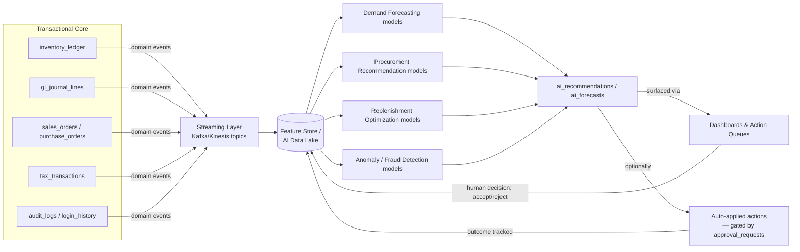

The feedback loop at the bottom — every human accept/reject decision and every
auto-applied action's real-world outcome flows back into the feature store — is what
turns this from "a model that runs once" into a **continuously-improving system**.

### 15.2 Phased Roadmap

| Phase | Capability | Data Inputs | Output | Target Tables |
|---|---|---|---|---|
| **Phase 1 — Foundation** (0–6 mo) | Governed data exports, BI dashboards, rule-based reorder alerts | `inventory_balances`, `inventory_ledger`, `sales_order_lines` | Threshold-based alerts; analyst dashboards | `saved_reports`, `dashboards` |
| **Phase 2 — Demand Forecasting** (6–12 mo) | Item/warehouse-level demand forecasts (statistical + ML: Prophet/ARIMA → gradient-boosted/temporal models) | Historical `inventory_ledger` ISSUE events, `sales_order_lines`, seasonality, promotions, external signals (holidays, weather feeds) | Forecasted demand with confidence bands | `ai_forecasts`, `ai_model_runs` |
| **Phase 3 — AI Procurement Recommendations** (12–18 mo) | Reorder quantity/timing suggestions; supplier selection scoring | `ai_forecasts`, `supplier_items` (cost/lead-time), `supplier_ratings`, open `purchase_orders` | Suggested POs with rationale & confidence | `ai_recommendations` (`type = REORDER` / `SUPPLIER_SWITCH`) |
| **Phase 4 — Replenishment Engine** (18–24 mo) | Closed-loop, policy-driven auto-replenishment (min/max, EOQ, multi-echelon) with human-in-the-loop guardrails | Phase 2/3 outputs, `inventory_balances`, lead-time variability | Auto-generated `purchase_requisitions` / inter-warehouse `stock_transfers`, gated by `approval_requests` for amounts above policy thresholds | `ai_recommendations`, `purchase_requisitions`, `stock_transfers` |
| **Phase 5 — Anomaly & Fraud Detection** (parallel track) | Detect unusual ledger/GL/access patterns (shrinkage, mis-posting, privilege misuse, fictitious vendors) | `inventory_ledger` reversal patterns, `gl_journal_headers` reversal/manual-entry rates, `audit_logs`, `login_history` | Flagged exception queue with explainable rationale | `ai_recommendations` (`type` extended with `ANOMALY_FLAG`), `audit_logs` |
| **Phase 6 — Pricing & Slow-Mover Intelligence** | Dynamic price suggestions, clearance recommendations for aging/slow-moving stock | `inventory_balances` aging, `inventory_valuation_layers`, `price_lists`, margin data from GL | Price-adjustment / clearance suggestions | `ai_recommendations` (`PRICE_ADJUST`, `SLOW_MOVER_CLEARANCE`) |
| **Phase 7 — Logistics & Route Optimization** | Pick-path refinement, load building, delivery route optimization | `warehouse_tasks` scan-time data, `shipments`, carrier performance | Optimized pick sequences & routes | `ai_recommendations` (`ROUTE_OPTIMIZATION`), `pick_lists` |
| **Phase 8 — Conversational / Agentic Interfaces** | Natural-language query over governed data; agentic workflows ("find slow movers in Mumbai DC and draft clearance POs") | All of the above via the governed API surface (§14) | Conversational answers; draft documents routed through normal approval workflows | All — via API, never direct DB access |

### 15.3 Model Lifecycle & Governance

- **`ai_model_runs`** captures model version, training data window, hyperparameters, and
  evaluation metrics for every run — giving full reproducibility and the ability to
  explain *why* a particular forecast or recommendation was produced (a regulatory and
  trust requirement, not a nice-to-have, when AI suggestions influence purchasing and
  pricing decisions).
- **Human-in-the-loop by default**: every `ai_recommendations` row starts as `PROPOSED`
  and requires a human `decided_by` action (`ACCEPTED`/`REJECTED`) unless the tenant has
  explicitly configured **auto-apply policies** for low-risk, high-confidence categories
  (e.g., auto-reorder for items below a small monetary threshold) — and even then, the
  resulting action is logged and routed through `approval_requests` if it exceeds
  configured limits (§5.13, §12).
- **Explainability**: `ai_recommendations.payload` is structured JSON that always
  includes a human-readable `rationale` — "Recommended reordering 500 units of SKU-204
  because: 14-day forecast = 620 units, current on-hand = 140, lead time = 9 days,
  preferred supplier X has 96% on-time rate" — generated alongside the numeric
  prediction, not as an afterthought.

### 15.4 Anomaly Detection — Worked Example

Combining the immutable ledgers with the audit trail enables detection patterns that are
structurally impossible to spot in systems where balances can be edited directly:

> *"Flag any `inventory_ledger` `ADJUSTMENT_NEGATIVE` entry where (a) the same
> `created_by` user posted the offsetting `RECEIPT` within the prior 30 days, (b) the
> `reason_code` is `'COUNT_VARIANCE'`, and (c) the `audit_logs` show the user accessed
> the item's cost data shortly before the adjustment — a pattern consistent with
> inventory shrinkage concealment."*

This is a SQL query (or feature-engineering pipeline) over data the system *already
produces as a byproduct of normal operation* — no special instrumentation required,
because the ledger-first design makes every state change an explainable event by
construction.

### 15.5 AI Service Architecture

AI/ML services run as **independently deployable workers/services** (not inline with
transactional request paths), consuming from the streaming layer and the read-replica
surface, and writing results back exclusively through the governed API (§14.4) — keeping
model-training and inference workloads from ever competing with OLTP transactions for
database resources, and ensuring every AI-originated action passes through the same
RBAC/audit/approval machinery as a human-originated one.

---

## 16. Technology Stack Recommendations

### 16.1 Guiding Principles

1. **Match the existing Aivora codebase** (NestJS + Next.js + Prisma + PostgreSQL,
   per the current `apps/api` and `apps/web` workspaces) rather than introducing a
   parallel stack — minimizing onboarding cost and maximizing code/tooling reuse.
2. **Boring technology for the ledger core; room to innovate at the edges.** The
   inventory/GL ledger and posting engines are the "must never be wrong" heart of the
   system — they run on a mature relational database with strong consistency
   guarantees. AI/ML, search, and analytics can use more specialized, faster-moving
   tools without putting the core at risk.
3. **Open standards over vendor lock-in** where the cost is comparable (OpenAPI, OIDC,
   SQL, Kafka-compatible streaming) — preserving the optionality to change cloud
   providers (§17) or specific managed services later.

### 16.2 Recommended Stack by Layer

| Layer | Recommendation | Rationale |
|---|---|---|
| **Backend framework** | NestJS (TypeScript) — already in use (`apps/api`) | Modular, DI-based architecture maps directly onto the bounded-context module design (§3.3); strong ecosystem for guards (RBAC), interceptors (audit logging), pipes (validation) |
| **Frontend framework** | Next.js (React, TypeScript) — already in use (`apps/web`) | Server-side rendering for dashboards/reports; shared TypeScript types with backend via `packages/shared` |
| **Mobile / Scanner app** | React Native or Progressive Web App with offline-first local store (WatermelonDB / SQLite + sync engine) | Code-sharing with the web TypeScript codebase; mature offline-sync patterns for warehouse connectivity gaps (§9.2) |
| **Primary database** | PostgreSQL 16+ | Native Row-Level Security (§13.3), declarative partitioning (§6.1), `JSONB` for flexible payloads (`ai_recommendations.payload`, `audit_logs` snapshots), strong transactional guarantees for ledger integrity, mature ecosystem (Prisma already in use) |
| **ORM / migrations** | Prisma — already in use (`apps/api/prisma/schema.prisma`) | Type-safe queries matching the TypeScript-first stack; explicit migration history supports the "schema as code, reviewed like code" discipline financial systems require |
| **Caching / session store** | Redis | Permission-resolution cache (§12.9), rate-limit counters, idempotency-key tracking (§14.2), session/refresh-token store |
| **Streaming / event bus** | Apache Kafka (or managed equivalent: AWS MSK / Confluent Cloud / Azure Event Hubs / GCP Pub/Sub with Kafka-compatible API) | Durable, replayable event log — a natural fit for "every domain event becomes an AI training signal" (§15.1); decouples integrations and AI consumers from OLTP load |
| **Search / full-text** | OpenSearch / Elasticsearch | Item/supplier/customer search, faceted filtering, operational dashboards over event data |
| **AI/ML platform** | Python (FastAPI services) + PyTorch/scikit-learn/Prophet for modeling; orchestration via Airflow or Dagster; served via a model-serving layer (e.g., managed endpoints / Triton / BentoML) | Python remains the dominant ML ecosystem; isolating AI services in their own runtime (§15.5) avoids forcing ML tooling constraints onto the transactional backend |
| **Feature store / AI data lake** | Cloud object storage (S3/ADLS/GCS) + a lakehouse table format (Apache Iceberg / Delta Lake) + a feature-store layer (Feast or managed equivalent) | Decouples model training data from OLTP replicas; supports point-in-time correct feature retrieval (essential for valid backtesting) |
| **Background jobs / workers** | BullMQ (Node, for in-stack jobs: balance projection, posting engine, notification dispatch) + dedicated workers for heavier AI/ETL pipelines | Matches existing Node/TypeScript stack for core workflows; keeps heavy compute isolated |
| **API documentation** | OpenAPI 3.1 (generated from NestJS decorators) + GraphQL SDL for the aggregation gateway | Single source of truth for client SDK generation (§14.1) |
| **Authentication** | OIDC-compliant identity provider (e.g., Auth0 / Azure AD B2C / Keycloak self-hosted) integrated via NestJS Passport strategies | Avoids building and maintaining custom credential storage; supports enterprise SSO requirements out of the box |
| **Observability** | OpenTelemetry (traces/metrics/logs) → Grafana/Prometheus or a managed APM (Datadog/New Relic) | Vendor-neutral instrumentation standard; correlates gateway → service → DB → event-publish spans (§14.2) |
| **CI/CD** | GitHub Actions (matches the existing `mchepuri/aivora` GitHub repo) with environment-gated deployment pipelines | Native integration with the existing source control; supports the test/build/deploy stages needed for a financial system's change-control discipline |
| **Infrastructure as Code** | Terraform (cloud-agnostic) | Enables the multi-cloud deployment options discussed in §17 without rewriting provisioning logic |

### 16.3 Why Not [Alternative]? — Notable Trade-offs

- **NoSQL for the ledger?** Rejected. The double-entry/balanced-journal invariant
  (§8.1) and cross-table consistency (ledger ↔ valuation layers ↔ GL) depend on ACID
  transactions and relational constraints that document/wide-column stores don't
  provide as first-class guarantees — using one would mean re-implementing transaction
  semantics in application code, exactly the kind of risk a financial system cannot
  carry.
- **Microservices from day one?** Deferred. A modular monolith (§3.2) delivers faster
  initially (simpler transactions across module boundaries, e.g., posting a GRN touches
  Inventory, Procurement, and GL atomically) while preserving clean module boundaries
  that make *future* extraction of high-load domains (Inventory Ledger, AI services)
  straightforward once real scaling pressure — not speculative pressure — appears.
- **Building a custom auth system?** Rejected in favor of an OIDC provider — credential
  storage and MFA are well-solved problems with severe consequences for getting wrong;
  buying proven security here is the right trade against a small recurring cost.

---

## 17. Deployment Architecture (AWS / Azure / GCP)

### 17.1 Cloud-Agnostic Reference Topology

The platform is designed so the *same* container images and Terraform modules deploy to
any major cloud — only the managed-service bindings change. This is a deliberate hedge
against vendor lock-in and a response to enterprise customers' frequent data-residency /
existing-cloud-relationship requirements.

```mermaid
flowchart TB
    subgraph EDGE["Edge / CDN"]
        CDN[CDN + WAF\nstatic assets, DDoS protection]
    end
    subgraph NET["Virtual Network — multi-AZ"]
        LB[Load Balancer / API Gateway\nTLS termination, routing]
        subgraph APP["Application Tier — autoscaling container groups"]
            WEB[Next.js Web\ncontainers]
            API[NestJS API\ncontainers]
            WORKER[Background Workers\nposting engine, balance projection,\nnotifications]
            AI[AI/ML Services\nFastAPI inference + training jobs]
        end
        subgraph DATA["Data Tier"]
            PG[(PostgreSQL\nprimary + read replicas\nMulti-AZ, automated backups)]
            REDIS[(Redis\ncache / sessions / queues)]
            KAFKA[(Managed Kafka /\nevent streaming)]
            SEARCH[(OpenSearch cluster)]
            LAKE[(Object storage\nfeature store / archives /\ndocument attachments)]
        end
    end
    subgraph SEC["Cross-Cutting"]
        SECRETS[Secrets Manager / KMS]
        IAM[IAM / OIDC Identity Provider]
        OBS[Observability stack\nmetrics · logs · traces]
        CI[CI/CD Pipeline]
    end

    CDN --> LB --> WEB & API
    API --> PG & REDIS & KAFKA & SEARCH
    WORKER --> PG & REDIS & KAFKA
    AI --> KAFKA & LAKE & PG
    KAFKA --> LAKE
    API & WEB & WORKER & AI -.-> SECRETS & IAM & OBS
    CI -.deploys.-> APP
```

### 17.2 Service Mapping by Cloud Provider

| Capability | AWS | Azure | GCP |
|---|---|---|---|
| Container orchestration | ECS Fargate / EKS | Azure Container Apps / AKS | Cloud Run / GKE |
| Managed PostgreSQL | RDS for PostgreSQL / Aurora PostgreSQL | Azure Database for PostgreSQL Flexible Server | Cloud SQL for PostgreSQL / AlloyDB |
| Managed Redis | ElastiCache for Redis | Azure Cache for Redis | Memorystore for Redis |
| Event streaming | MSK (Managed Kafka) / Kinesis | Event Hubs (Kafka-compatible) | Pub/Sub (+ Kafka-compatible bridge if needed) |
| Object storage | S3 | Blob Storage | Cloud Storage |
| Search | OpenSearch Service | Azure AI Search / self-managed OpenSearch on AKS | self-managed OpenSearch on GKE / Elastic Cloud |
| Secrets & KMS | Secrets Manager + KMS | Key Vault | Secret Manager + Cloud KMS |
| CDN / WAF | CloudFront + AWS WAF | Azure Front Door + WAF | Cloud CDN + Cloud Armor |
| Identity | Cognito (or external OIDC: Auth0/Okta) | Azure AD B2C | Identity Platform (or external OIDC) |
| Observability | CloudWatch + X-Ray (or Datadog) | Azure Monitor + App Insights (or Datadog) | Cloud Monitoring + Trace (or Datadog) |
| IaC | Terraform (`aws` provider) | Terraform (`azurerm` provider) | Terraform (`google` provider) |
| CI/CD | GitHub Actions → ECR → ECS/EKS | GitHub Actions → ACR → Container Apps/AKS | GitHub Actions → Artifact Registry → Cloud Run/GKE |

> Terraform modules are organized so that 80–90% (application tier, networking
> topology, observability wiring) is provider-agnostic via thin per-cloud adapter
> modules — only the data-tier and identity bindings differ meaningfully between
> providers.

### 17.3 Environment Strategy

```
Local (docker-compose: Postgres + Redis + Kafka + API + Web)
   │
   ▼
Dev  ──▶  Staging (production-like, synthetic/anonymized data, full integration tests)
   │           │
   │           ▼
   │      UAT / Pre-prod (customer pilot tenants, feature-flagged rollouts)
   │           │
   ▼           ▼
            Production (multi-AZ, automated failover, blue/green or canary deploys)
```

- **Pipeline gates**: unit + integration tests → schema-migration dry-run against a
  staging snapshot → security/SAST scan → canary deploy with automated rollback on
  error-rate/latency SLO breach.
- **Database migrations** run as a distinct, reviewed pipeline stage (Prisma migrate)
  *before* application deploy, with backward-compatible "expand/contract" migration
  patterns so that old and new application versions can run simultaneously during a
  rolling deploy without breaking.

### 17.4 Resilience & Scaling

| Concern | Approach |
|---|---|
| High availability | Multi-AZ database (primary + standby with automated failover); stateless app tier behind load balancer with health-check-based instance replacement |
| Read scaling | PostgreSQL read replicas serve reporting/analytics/GraphQL aggregation queries (§3.2); connection routing splits write vs. read traffic at the ORM/gateway layer |
| Write scaling | Vertical scaling of the primary (ledger writes are inherently serialized per company via `entry_no`); partitioning (§6.1) keeps index sizes manageable as volume grows; the Inventory Ledger module is the first candidate for extraction into an independently-scaled service if/when write throughput becomes the bottleneck |
| Disaster recovery | Automated point-in-time-recovery backups (continuous WAL archiving); cross-region backup replication; documented RPO/RTO targets per tenant tier (e.g., RPO ≤ 5 min, RTO ≤ 1 hr for standard tier; tighter for enterprise tier) |
| Background processing | Queue-backed workers (BullMQ/Redis or managed queue service) with retry/backoff and dead-letter queues for the balance-projection, GL-posting, and notification pipelines — ensuring a transient failure never silently drops a ledger-derived side effect |
| Capacity planning | Autoscaling policies driven by queue depth (workers), request latency/CPU (API), and connection pool saturation (database proxy tier) |

### 17.5 Security & Compliance Posture in Deployment

- **Network isolation**: application and data tiers in private subnets; only the load
  balancer/CDN is internet-facing; database accessible only from the application
  security group.
- **Encryption**: TLS in transit everywhere; encryption at rest for database, object
  storage, and backups via cloud KMS-managed keys (with optional customer-managed keys
  for enterprise tenants requiring it).
- **Secrets management**: no credentials in container images or environment files in
  source control — runtime injection from Secrets Manager/Key Vault/Secret Manager,
  rotated on a schedule.
- **Compliance alignment**: the architecture is designed to support SOC 2 Type II
  control objectives (access logging via `audit_logs`, change management via CI/CD
  gates, encryption, incident response tooling via observability stack) and India's
  data-protection/GST data-retention requirements (configurable per-tenant retention
  policies feeding the partition-archival jobs of §6.1).

---

## 18. UML & Data Flow Diagrams

### 18.1 Use Case Diagram — Core Actors & Capabilities

```mermaid
flowchart LR
    actor1((Warehouse\nOperator))
    actor2((Procurement\nManager))
    actor3((Sales / Order\nDesk))
    actor4((Accountant /\nController))
    actor5((Tenant\nAdmin))
    actor6((AI / ML\nService))

    actor1 --> uc1[Scan receive / putaway / pick / count]
    actor1 --> uc2[Execute directed warehouse tasks]
    actor2 --> uc3[Create & approve Purchase Orders]
    actor2 --> uc4[Review AI reorder recommendations]
    actor3 --> uc5[Enter Sales Orders & check ATP]
    actor3 --> uc6[Track shipments & manage returns]
    actor4 --> uc7[Process AP/AR invoices & payments]
    actor4 --> uc8[Close fiscal periods & run financial reports]
    actor5 --> uc9[Configure roles, tax codes, workflows]
    actor5 --> uc10[Manage users & approval policies]
    actor6 --> uc11[Generate forecasts & recommendations]
    actor6 --> uc12[Flag anomalies for review]

    uc4 -.extends.-> uc11
    uc8 -.includes.-> uc7
    uc2 -.includes.-> uc1
```

### 18.2 Class / Domain Object Diagram — Core Aggregates

```mermaid
classDiagram
    class PurchaseOrder {
      +UUID id
      +String poNumber
      +Status status
      +approve()
      +amend()
      +close()
    }
    class GoodsReceiptNote {
      +UUID id
      +post() : InventoryLedgerEntry[]
    }
    class InventoryLedgerEntry {
      <<immutable>>
      +BigInt entryNo
      +Decimal quantity
      +reverse() : InventoryLedgerEntry
    }
    class InventoryBalance {
      <<derived>>
      +Decimal quantityOnHand
      +Decimal quantityAvailable
      +rebuildFromLedger()
    }
    class SalesOrder {
      +allocate() : InventoryReservation[]
      +ship() : Shipment
    }
    class GLJournalHeader {
      <<immutable>>
      +Boolean isBalanced
      +post()
      +reverse() : GLJournalHeader
    }
    class GLPostingEngine {
      +postFromEvent(event) : GLJournalHeader
    }

    PurchaseOrder "1" --> "*" GoodsReceiptNote : fulfilled by
    GoodsReceiptNote "1" --> "*" InventoryLedgerEntry : generates
    InventoryLedgerEntry "*" --> "1" InventoryBalance : aggregates into
    SalesOrder "1" --> "*" InventoryLedgerEntry : generates (on ship)
    GoodsReceiptNote ..> GLPostingEngine : triggers
    SalesOrder ..> GLPostingEngine : triggers
    GLPostingEngine --> GLJournalHeader : creates (balanced)
    InventoryLedgerEntry ..> InventoryLedgerEntry : reverses (self)
    GLJournalHeader ..> GLJournalHeader : reverses (self)
```

### 18.3 Sequence Diagram — "Receive Goods → Stock Available → GL Posted"
*(end-to-end trace tying together §7, §8, §9)*

```mermaid
sequenceDiagram
    actor Op as Warehouse Operator
    participant Dev as Scanner Device
    participant API as API / Domain Services
    participant LED as Inventory Ledger
    participant BAL as Inventory Balances
    participant GL as GL Posting Engine
    participant TAX as Tax Engine

    Op->>Dev: Scan PO barcode + item + LP + quantity
    Dev->>API: POST /grn  {idempotency-key, scan payload}
    API->>API: Validate against open PO line (qty/price tolerance)
    API->>LED: INSERT RECEIPT entry (entry_no = N, item, qty, unit_cost)
    API->>BAL: UPSERT balance Δ (same DB transaction)
    API->>TAX: Compute input tax on landed cost (if applicable)
    TAX->>API: tax_transactions rows
    API->>GL: emit GRNPosted{amount}
    GL->>GL: Resolve posting rule (Dr Inventory / Cr GR-IR Clearing)
    GL->>GL: INSERT balanced journal header + lines (status=POSTED)
    API-->>Dev: 201 Created — ack scan, push next task (Putaway)
    Dev-->>Op: "Move to Bin A-01-03-B"
    Op->>Dev: Scan destination bin
    Dev->>API: POST /warehouse/scan-events (putaway confirmation)
    API->>LED: (no new ledger entry — same stock, location updates via task completion)
    API-->>Dev: Task complete — stock now available for allocation
```

### 18.4 Data Flow Diagram (Level 1) — Whole-System View

```mermaid
flowchart TD
    EXT1[Suppliers] -->|PO responses, ASNs, invoices| P1((1.0\nProcurement))
    EXT2[Customers] -->|Orders, payments| P3((3.0\nSales & Distribution))
    P1 -->|GRN postings| P2((2.0\nInventory & Warehouse))
    P3 -->|Shipment postings| P2
    P2 -->|Stock movement events| D1[(Inventory Ledger)]
    P1 & P3 -->|Tax-relevant line data| P4((4.0\nTax Engine))
    P1 & P3 & P2 -->|Financial events| P5((5.0\nGeneral Ledger))
    P4 -->|Tax journals| P5
    D1 -->|COGS / valuation events| P5
    P5 -->|Journals| D2[(GL Ledger)]
    D1 & D2 -->|Event streams| P6((6.0\nAI / Analytics))
    P6 -->|Forecasts & recommendations| P1
    P6 -->|Replenishment suggestions| P2
    P6 -->|Anomaly flags| P7((7.0\nSecurity & Audit))
    P1 & P2 & P3 & P5 -->|Privileged actions| P7
    P7 -->|Audit records| D3[(Audit Log)]
    P5 -->|Statutory data| EXT3[Tax Authorities\ne-Invoice / e-Way Bill / Returns]
    P6 -->|Dashboards & reports| EXT4[Executives / Analysts]
```

### 18.5 Activity Diagram — Sales Order to Cash Lifecycle

```mermaid
flowchart TD
    Start([Customer places order]) --> A[Create Sales Order — DRAFT]
    A --> B{Credit check passes?}
    B -- No --> B1[Route to credit-hold approval]
    B1 --> B
    B -- Yes --> C[Confirm order — CONFIRMED]
    C --> D[Allocate stock — FEFO/FIFO reservation\ncreates inventory_reservations]
    D --> E{Stock available?}
    E -- No --> E1[Backorder / partial allocation\n→ trigger AI replenishment recommendation]
    E1 --> D
    E -- Yes --> F[Generate pick list & warehouse tasks]
    F --> G[Pick → Pack → Ship\n— scan-confirmed, posts ISSUE ledger entries]
    G --> H[Generate AR Invoice\n+ tax_transactions + e-invoice if applicable]
    H --> I[Post GL Journal:\nDr AR / Cr Revenue + Output Tax\nDr COGS / Cr Inventory]
    I --> J[Customer remits payment]
    J --> K[Record AR Receipt → allocate to invoice]
    K --> L[Post GL Journal: Dr Bank / Cr AR]
    L --> End([Order closed — fully reconciled\nInventory ↔ AR ↔ GL])
```

---

## Appendix: Document Change Log

| Version | Date | Summary |
|---|---|---|
| 1.0 | 2026 (initial) | Executive summary, core principles, module list, high-level ER map, ~170-table footprint estimate |
| 2.0 | 2026-06-06 | Full expansion: business requirements, functional architecture, 124-table domain inventory with ER diagrams, backbone-table schema definitions with PK/FK conventions, Inventory Ledger and GL posting flow designs, Warehouse/Barcode and Batch/Serial traceability architectures, GST/Tax architecture, RBAC model, Multi-Tenant SaaS design, API architecture, AI/ML roadmap, technology stack recommendations, multi-cloud deployment architecture, and UML/data-flow diagrams |
| 2.1 | 2026-06-06 | Redesigned §12 RBAC Security Model as a layered **hybrid RBAC + ABAC + Segregation-of-Duties + Delegation** architecture, with an explicit comparison against pure-RBAC/ABAC/ReBAC alternatives; added `sod_conflict_rules`, `sod_violations`, and `role_delegations` tables plus a `condition_expr JSONB` overlay on `role_permissions` for value-based conditional grants; domain inventory grows from 124 → **127 tables** (Security & RBAC: 10 → 13) |


